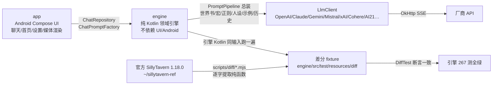

# 交接清单（会话上下文耗尽时使用）

> 最后更新：2026-08-09。接手顺序：第 0 节一眼看懂 → 1 常用命令 → 2 差分怎么用 → 3/4 现状 → 5 剩余工作 → 6 日志。

## 0. 一眼看懂：这是什么、怎么保证 1:1



- 一句话：**App 只做“调用引擎 + 渲染”，引擎和官方 SillyTavern 1:1，UI 层自由**。
- “差分”= 同一输入，官方 JS 与引擎 Kotlin 各跑一遍，输出必须逐字一致；fixture 由脚本生成、不许手改。
- 官方基线：release `8172dcd`（SillyTavern **1.18.0**）；酒馆更新后重跑 `node scripts/diff/*.mjs`，红的就是要移植的差异。

## 1. 项目与常用命令

- 项目：EmberInn（余烬酒馆）——原生 Android SillyTavern 兼容客户端
- 本地：`/data/data/com.termux/files/home/ember-inn`；远程：github.com/heikeyangle-code/ember-inn（main，公开）
- 官方源码参照：`/data/data/com.termux/files/home/sillytavern-ref`（release 分支）

常用命令：

```sh
# 引擎测试（本机可跑：Java 21 + Gradle 9.7；App 编译只能靠 CI）
cd ~/ember-inn && ./gradlew :engine:test

# 改引擎/官方发版后：重新生成差分 fixture + 打包官方预设
node scripts/diff/*.mjs
node scripts/build-presets.mjs

# 推送（本机已 gh auth setup-git；网络不稳失败就重试；push 会自动触发 CI）
git push origin main

# 手工触发 CI（一般不需要，push 自动跑）
gh workflow run 328789880 --ref main
# 看结果
gh run list --limit 3
```

CI：`.github/workflows/build.yml`，两个 job：`engine-test`（:engine:test）与 `build`（单测 + assembleDebug + assembleRelease + 出 APK）。当前以 `gh run list` 为准。引擎本地 **267 测全绿**。

## 2. 什么是差分验证（新会话必读）

**目标**：EmberInn 是酒馆兼容软件，引擎逻辑必须和官方 SillyTavern 1:1。
“差分验证” = 同一输入，官方 JS 跑一遍、我们 Kotlin 跑一遍，输出必须一致。
手写期望值的单测只是自证；差分才是“官方说对才算对”的机器验证。

**怎么用**：
1. `scripts/diff/*-official.mjs` 从 `~/sillytavern-ref` 逐字提取官方函数，桩掉 DOM/全局依赖，生成 fixture：`engine/src/test/resources/diff/*.json`
2. `engine/src/test/.../*DiffTest.kt` 读 fixture，调 Kotlin 引擎逐例对比
3. 官方发版 / 我们改代码后：`node scripts/diff/*.mjs` 重新生成 fixture → `./gradlew :engine:test`
4. fixture 只能由脚本生成，不许手改；新功能先加 case 再实现

**已覆盖（54 组差分 fixture，共 801 例对拍，全部通过）**：
> 说明：历史日志里的“官方基准 8xx”是当时的累计口径，不等于 fixture 用例数；当前以 54 组 / 801 例（机器数）为准。

| 组 | 脚本 | 测试 | 例数 |
|---|---|---|---|
| instruct 提示词 | instruct-official.mjs | InstructModeDiffTest | 36 |
| 世界书纯逻辑 | worldinfo-official.mjs | WorldInfoDiffTest | 19 |
| 世界书整体扫描 | worldinfo-scan-official.mjs | WorldInfoScanDiffTest | 17 |
| 世界书文件 | worldinfo-file-official.mjs | WorldInfoFileDiffTest | 2 |
| 正则 | regex-official.mjs | RegexDiffTest | 20 |
| PNG 角色卡 | card-png-official.mjs | CardPngDiffTest | 6 |
| 宏 e2e | macros-official.mjs | MacroDiffTest | 158 |
| {{pick}} 确定性 | pick-official.mjs | PickDiffTest | 5 |
| 编辑器排序 | editor-sort-official.mjs | EditorSortDiffTest | 6 |
| 快捷回复自动执行选择 | auto-execute-official.mjs | AutoExecuteDiffTest | 4 |
| 向量工具函数 | vector-utils-official.mjs | VectorUtilsDiffTest | 14 |
| 角色卡 V2 归一 | char-v2-official.mjs | CharV2DiffTest | 5 |
| 世界书正则解析 | regex-parse-official.mjs | RegexParseDiffTest | 9 |
| 作用域宏内容裁剪 | macro-trim-official.mjs | MacroTrimDiffTest | 7 |
| Anthropic 请求体 | anthropic-body-official.mjs | AnthropicBodyDiffTest | 17 |
| Gemini 请求体 | gemini-body-official.mjs | GeminiBodyDiffTest | 16 |
| 聊天历史填充 | chat-history-pop-official.mjs | ChatHistoryPopDiffTest | 5 |
| 示例对话填充 | dialogue-examples-pop-official.mjs | DialogueExamplesPopDiffTest | 4 |
| YAML 角色卡导入 | yaml-import-official.mjs | YamlImportDiffTest | 5 |
| 提示词组装合并 | prepare-prompts-official.mjs | PreparePromptsDiffTest | 7 |
| CharX 角色卡导入 | charx-import-official.mjs | CharXImportDiffTest | 9 |
| BYAF 纯逻辑 | byaf-macros-official.mjs | ByafMacrosDiffTest | 14 |
| BYAF 聊天导入 | byaf-chat-official.mjs | ByafChatDiffTest | 5 |
| BYAF 角色卡组装 | byaf-card-official.mjs | ByafCardDiffTest | 4 |
| PromptManager 名字规则 | prompt-name-official.mjs | PromptNameDiffTest | 28 |
| 表情精灵引擎 | expression-engine-official.mjs | ExpressionEngineDiffTest | 19 |
| 表情分类文本预处理 | expression-classify-official.mjs | ExpressionClassifyDiffTest | 8 |
| 群聊成员激活 | group-activation-official.mjs | GroupActivationDiffTest | 15 |
| 群聊角色卡合并 | group-cards-official.mjs | GroupCardsDiffTest | 8 |
| 群聊深度提示 | group-depth-official.mjs | GroupDepthDiffTest | 7 |
| 精灵存储/Risu 导入 | sprites-storage-official.mjs | SpriteStorageDiffTest | 9 |
| 角色卡字段聚合 | character-fields-official.mjs | CharacterFieldsDiffTest | 8 |
| JSON 角色卡导入 | json-import-official.mjs | JsonImportDiffTest | 10 |
| BYAF 完整导入 | byaf-import-official.mjs | ByafImportDiffTest | 8 |
| 斜杠转义判定 | slash-escape-official.mjs | SlashEscapeDiffTest | 13 |
| 提示词工具 | prompt-utils-official.mjs | PromptUtilsDiffTest | 9 |
| JSON 角色卡导出 | json-export-official.mjs | JsonExportDiffTest | 6 |
| SSE 流解析 | sse-stream-official.mjs | SseStreamDiffTest | 16 |
| 正则整体管线 | regex-pipeline-official.mjs | RegexPipelineDiffTest | 10 |
| 导演备注 | authors-note-official.mjs | AuthorsNoteDiffTest | 7 |
| 人设引擎 | persona-engine-official.mjs | PersonaEngineDiffTest | 16 |
| 群聊完整循环 | group-loop-official.mjs | GroupLoopDiffTest | 11 |
| OpenAI 请求体（全厂商） | openai-params-official.mjs | OpenAiParamsDiffTest | 27 |
| 工具 token 预分配 | tool-budget-official.mjs | ToolBudgetDiffTest | 4 |
| ChatCompletionPipeline 计划 | chat-pipeline-official.mjs | ChatPipelineDiffTest | 5 |
| 媒体附件纯逻辑 | media-engine-official.mjs | MediaEngineDiffTest | 17 |
| 媒体内联（OpenAI） | media-inline-official.mjs | MediaInlineDiffTest | 7 |
| 媒体 token 成本 | media-cost-official.mjs | MediaCostDiffTest | 18 |
| 特殊协议请求体（Mistral/xAI/AI21/Cohere） | special-bodies-official.mjs | SpecialBodiesDiffTest | 23 |
| OpenAI 文本补全请求体 | text-completion-body-official.mjs | TextCompletionBodyDiffTest | 6 |
| BYAF 资源提取 | byaf-assets-official.mjs | ByafAssetsDiffTest | 6 |
| 提示词总装整链（prepareOpenAIMessages+populateChatCompletion，含工具/媒体/推理签名/continue-nudge 分支） | prepare-messages-official.mjs | PromptPipelineDiffTest | 20 |
| 媒体内容块转换（Claude/Gemini） | media-convert-official.mjs | MediaConvertDiffTest | 25 |
| 消息转换整链（Claude/Gemini） | prompt-converters-official.mjs | PromptConvertersDiffTest | 41 |
| 消息缓存深度（Claude/OpenRouter） | prompt-converters-official.mjs | PromptConvertersDiffTest | 4+3 |
| 其余提供商转换器+合并+预算+OpenRouter | prompt-converters-official.mjs | PromptConvertersDiffTest | 61 |

**分支级覆盖审计与打桩登记（防漏机制，2026-08-08 起强制）**
- 规则：差分脚本内任何打桩/未覆盖分支，必须登记在本节 + 脚本头部注释；未登记即视为未完成，不许声称该分支 1:1。
- prepare-messages（总装整链，20 例（2026-08-09 补顶层 continue-nudge 非 prefill 用例，锁 PromptPipeline→ChatHistoryPopulator 的 cyclePrompt 透传））：populationInjectionPrompts 已用官方真函数；getExtensionPrompt(IN_CHAT) 恒空串（官方内置扩展源，Kotlin 同步为空）；preparePromptsForChatCompletion 用 fixture 注入的同一提示集合（该函数自身 7 例差分）；**工具调用历史 / 推理链（active_chain/since_last_user）/ 推理签名 / 媒体内联（list/gallery/data URL）已补端到端 8 例**，打桩登记见脚本头部：registerFunctionToolsOpenAI 空对象 → 工具预算预分配恒 1 token；setToolCalls tokens = JSON.stringify 长度/4（官方 tokenHandler 对象整体计数，两端同一近似）；getChat content 归一 `?? ''`；媒体仅 data: URL 内联且只记账，content 数组表示由 MediaInliner/MediaConvert 差分单独覆盖；群聊 selected_group、names_behavior、send_if_empty、预算溢出、squash 开关均已覆盖。in-chat 扩展合并的 order==100 规则由引擎单测锁（官方 getExtensionPrompt 恒空，差分无法覆盖）。
- SSE：运行时只有官方对拍的 SseChunkParser 一条路（逐字符、事件级 catch 跳过 = 官方平滑流语义、[DONE]/message_stop 收尾、reasoning 独立通道）；旧 SseParser 已删除（曾把 content:null 拼成字面 "null"）。
- **仍绕过 fixture 的部分**：prepareOpenAIMessages 的 chat→messages 构造循环（names_behavior 内容前缀、isSameModel 签名/推理过滤、media/invocations 从 extra 提取）由 fixture 直接注入消息对象绕过；Kotlin 侧由 App 的 ChatPromptFactory（JSONL → PromptMessage）按官方同名逻辑实现，接线点见 4.7/4.9。
- 其它脚本的历史打桩（Message/PromptManager/tokenHandler 等）均为“与 Kotlin 移植同语义”的显式桩，fixture 生成即对拍，登记在各自脚本头部。

**尚未做差分的**：网络/路由层（Mistral/xAI/Cohere/AI21/OpenRouter 请求体与响应解析用 MockWebServer 单测锁行为，转换器本身已逐字差分）；斜杠完整 parser（SlashCommandParser 依赖数十个模块与 DOM，无法逐字提取；转义判定 testSymbol 已差分 10 例，其余手写单测 + 源码对照）。
聊天重排/文件向量化主体（官方函数与 DOM/服务端焊死，无法逐字提取；其中纯函数 splitRecursive/trim 系列已差分 14 例）。
作用域宏配对逻辑（官方 MacroCstWalker 依赖 chevrotain CST 与 MacroRegistry，无法逐字提取；其中 trimScopedContent 纯函数已差分 7 例）。

**预设体系**：官方 `default/content/presets` 已打包进 engine resources（context 34 / instruct 38 / openai 1 / textgen 6 / novel 24 / kobold 6 / sysprompt 13 / reasoning 5，共 127 个），PresetLibrary 可加载；quick-replies 也打包。官方发版后跑 `node scripts/build-presets.mjs`。

## 3. 引擎进度（对照官方 release）

### 3.1 角色卡 ✅
PNG V2/V3（tEXt/ccv3）与 JSON 导入导出（官方也只导出 PNG/JSON）、CharX/YAML/BYAF 导入；JSON 导入 5 例 + JSON 导出 4 例（getCharaCardV2+unsetPrivateFields）、YAML 3 例、CharX 5 例、BYAF 14+5+4+4 例；V2 归一（readFromV2，官方差分 5 例 + 多轮补真 bug）、私有字段清理、JSON 导出（CharacterCardExporter）；PNG 字节级差分 6 例。
✅ CharX 资源提取（引擎 CharXImporter.CharXAssets）；✅ BYAF 资源提取（getCharacterImages/getChatBackgrounds 官方差分 6 例：默认头像回退、字节去重、paths 合并、url-join 不折叠 ../）；✅ App 层资源入库（2026-08-09：CharX icon→头像 + seed 取色，background/voice 落盘 assets/ 并记入 CharacterRecord；URL 导入未做）。

### 3.2 世界书 ✅（含 RAG 向量扩展）
buffer/matchKeys/getScore/parseDecorators、checkWorldInfo 整体扫描（含两段扫描、sticky/cooldown/概率）、深度/递归、分组评分、角色过滤、时间效果、多世界合并、装饰器/哈希、世界书文件导入导出、世界书↔角色书互转；正则在 BUILD 阶段接入扫描器。
✅ 扩展字段已全接上（数据全量透传 + 行为）：
   - vectorized → RAG：WorldInfoVectorActivation（同步/检索/强制激活，对齐 vectors activateWorldInfo）+ VectorStore/EmbeddingProvider（OpenAI 兼容）；**FileVectorStore 磁盘持久化对齐官方 vectra.LocalIndex**（目录 root/source/collection/model + items.json，重启不丢；InMemoryVectorStore 仅测试/临时）；Scanner 通过 externalActivations 强制激活（跳过关键词/概率）
   - 向量扩展补齐：**VectorChatRearranger**（聊天历史重排，对齐 rearrangeChat：protect 保留最近 N 条、insert 条数、模板 Past events:{{text}}、position 映射 BEFORE_PROMPT→start/IN_PROMPT→end）+ **文件/Data Bank 向量化**（对齐 processFiles/ingestDataBankAttachments/injectDataBankChunks/retrieveFileChunks/vectorizeFile：分块 splitRecursive、overlap、chunk 检索注入）+ VectorTextUtils（splitRecursive/trimToEndSentence/trimToStartSentence/overlapChunks 官方 1:1）
   - automationId → 快捷回复自动执行：WorldInfoAutoExecute.resolve + AutoExecuteHandler（对齐 quick-reply AutoExecuteHandler，prevent 栈；选择逻辑 4 例官方差分）
   - displayIndex → 编辑器排序：WorldInfoEditorSort（对齐 sortWorldInfoEntries，6 例官方差分，抓出 length 方向 bug 已修）
   - addMemo → 官方核心从未读取，仅透传

### 3.3 宏 ✅（含作用域宏）
通用作用域宏（{{setvar::x}}content{{/setvar}}、{{#}} 保留空白、嵌套、trim+dedent，对齐 MacroCstWalker.processScopedMacros）；trimScopedContent 官方差分 7 例；!?~> flags 官方标 TBD 未实现（无需补）；配对逻辑依赖 chevrotain CST 无法逐字差分（源码对照+单测）。
核心宏 + 官方 e2e 差分 158 例；变量简写全运算符、{{if}}、{{trim}} 作用域、legacy 标记/冒号/空格参数、嵌套参数、字段宏、聊天/状态宏；{{pick}} 用 seedrandom@3.0.5 逐位一致（5 例）。
✅ MacroRegistry 动态注册/注销/解析；✅ 宏 flags（{{#}} 保留空白已随作用域宏实现）；🟡 完整 MacroEnv（聊天/角色/系统状态）边界；!?~> 官方标 TBD 无需补。

### 3.4 斜杠 🟡
SlashParser（命名/无名/引号/转义/list 值/rawQuotes）+ SlashEngine（管道/闭包/双管道）、/pass /let /qr-arg、{{var}}/{{pipe}}/{{arg}} 状态宏、快捷回复执行器；SlashEscape（testSymbol 转义判定，STRICT_ESCAPING 奇偶反斜杠）官方差分 10 例。
🟡 偏差：官方惰性闭包（传给命令对象）与 () 即时执行统一为即时求值（近似）；命令数远少于官方。
✅ /parser-flag 命令已注册（引擎侧占位，参数保留）；❌ REPLACE_GETVAR/STRICT_ESCAPING 完整语义；150+ 官方命令多数未实现（多数依赖 App 状态）；无差分（SlashCommandParser 依赖数十模块与浏览器，无法逐字提取，源码对照+单测）。

### 3.5 提示词组装 ✅（核心）
PromptManagerCore（默认/用户顺序、enabled、injection_trigger、preparePrompt original/groupOverride、mergeSystemPrompts）、PromptCollection、ChatCompletion 嵌套集合（预算/溢出/squash）、ChatHistoryPopulator、DialogueExamplesPopulator、扩展注入（summary/AN/vectors/chromadb/persona/未知扩展）、in-chat 深度注入、continue nudge/prefill、bias、control prompts（impersonate/quiet）、nsfw/jailbreak/用户相对提示、工具调用（tool_calls）、ToolLoopPlanner 递归决策（官方 RECURSE_LIMIT=5：shouldContinue/buildNextMessages/nextRecursionCount，单测 4 例；工具真正执行在 App 扩展注册表）、人设 IN_CHAT 注入；**✅ PromptPipeline 总装器**（官方 prepareOpenAIMessages+populateChatCompletion 1:1：示例解析 parseExampleIntoIndividual/setOpenAIMessageExamples、控制提示、continue prefill、pin 顺序、squash；整链官方差分 20 例；in-chat 深度注入（populationInjectionPrompts：order 降序/角色固定序/深度 splice/reverse）已用官方真函数，扩展合并 order==100 规则由单测锁（官方 getExtensionPrompt 恒空，差分无法覆盖））、作者注释组合（ANWithWI）；CharacterCardFieldsEngine 官方差分 6 例；PromptUtils 官方差分 9 例；AuthorsNoteEngine（默认值解析+ANWithWI）官方差分 7 例（默认 position 修正为官方 1）。
✅ 每条历史消息过 preparePrompt 宏替换已补（对齐官方 populateChatHistory；ChatHistoryPrepareTest）；✅ names_behavior 已按真实官方修正：Message.fromPromptAsync 不复制 name（请求体只在 COMPLETION 模式带 name，且先 isValidName 再 sanitizeName——PromptNameSanitizer 28 例差分；2026-08-09 修正 DEFAULT 模式误带 name）；✅ 工具预分配 token、媒体内联、推理签名已补（整链差分 20 例）；多模态请求体已接（MediaInliner/MediaConvert 差分）；🟡 工具真正执行在 App 扩展注册表。

### 3.6 正则 ✅
RegexEngine + substituteRegex/宏替换 + 20 例差分（含 g/首匹配、i/m/s、非法 flags）；RegexPipelineEngine（getRegexedString：placement/markdownOnly/promptOnly/runOnEdit/minDepth/maxDepth/禁用扩展）官方差分 9 例；聊天消息正则已在扫描器接入（messageTransformer）。
🟡 global/preset/scoped 分桶与允许列表（App 层）。

### 3.7 预设 ✅
官方 127 个预设打包 + PresetLibrary；quick-replies 打包 + 执行器。moving-ui（界面预设）未打包。

### 3.8 聊天 🟡
jsonl 基础 + BYAF 聊天导入 + continue nudge。
❌ 聊天元数据（背景/书签/快照）（注：官方无 chat v2，此前审计有误已删）。

### 3.9 提供商 / LLM 客户端（引擎 1:1 审计）

**一句话结论**：OpenAI 兼容全家、Anthropic、Gemini（含预算自动推导）、Mistral、xAI、Cohere、AI21 路由全部接完（转换器均已差分移植，网络层用 MockWebServer 单测锁行为）；OpenRouter 已接媒体嵌入/推理签名/reasoning exclude，缓存标记待设置项；只剩 Vertex 服务账号认证未做。

| 提供商 | 协议路由 | 请求体 | 消息转换 | 媒体 | 预算/缓存/签名 | 模型列表 | 状态 |
|---|---|---|---|---|---|---|---|
| OpenAI | ✅ `/chat/completions` | ✅ 全厂商参数 27 例差分 | ✅ | ✅ MediaInliner 7 例差分 | — | ✅ `data[].id` | ✅ |
| Azure OpenAI | ✅ `deployments/{model}/chat/completions?api-version=2024-12-01` + api-key 头 | ✅ 同全厂商参数 | ✅ | ✅ | — | ✅ `value[].id` | ✅ |
| DeepSeek | ✅ `/beta/chat/completions` | ✅ | ✅（官方 sendDeepSeekRequest：postProcessPrompt semi_tools + addAssistantPrefix + addReasoningContentToToolCalls + reasoning_effort） | ✅ | — | ✅ | ✅ |
| Groq / Moonshot / MiniMax / 智谱 / 通义 / 硅基流动 / Z.AI / Fireworks / Perplexity / Custom / NanoGPT / Chutes / ElectronHub / SiliconFlow / o1 / Ollama | ✅ openai-compatible | ✅（各自厂商参数分支） | ✅ | ✅（OpenAI 媒体数组） | — | ✅ `data[].id` / 无端点时最小对话探测 | ✅ |
| Workers AI | ✅ `{account}/ai/v1/chat/completions` | ✅ | ✅ | ✅ | — | ✅ `result[].name` | ✅ |
| Anthropic | ✅ `/v1/messages` + x-api-key + anthropic-version | ✅ 17 例差分（thinking/tools/web_search/json_schema/beta/采样/verbosity/no-prefill） | ✅ `convertClaudeMessages` 整链 41 例差分，已接入 builder | ✅ `convertClaudePart` 25 例差分（image/text/video/audio → 块） | ✅ `calculateClaudeBudgetTokens` 已接入 LlmClient（SamplerParams.reasoningEffort 默认 auto；adaptive→effort 字符串/auto→不加 thinking） | 🟡 官方不发模型列表请求，用默认模型 | ✅ 差 tokenizer |
| Gemini AI Studio | ✅ `v1beta/models/{model}:generateContent?key=` | ✅ 16 例差分（generationConfig/thinkingConfig/tools/toolConfig/google_search/图像模态） | ✅ `convertGooglePrompt` 整链 41 例差分，已接入 builder | ✅ `convertGooglePart` 25 例差分（inlineData/分辨率） | ✅ `calculateGoogleBudgetTokens` 已接入 LlmClient（gemini-3 flash/pro→thinkingLevel，2.5→数字预算） | ✅ `models[].name`（过滤 generateContent） | ✅ 差 tokenizer |
| OpenRouter | ✅ openai-compatible | ✅（openrouter 参数分支 + transforms/plugins/reasoning.exclude/effort） | ✅ | ✅ `embedOpenRouterMedia`（audio+video）已接线 | ✅ `addOpenRouterSignatures` + `cachingAtDepthForOpenRouterClaude` + `cachingSystemPromptForOpenRouter`（SamplerParams 缓存开关/深度/TTL）+ DeepSeek `addReasoningContentToToolCalls` 全部接线 | ✅ | ✅ |
| Mistral | ✅ 专用路由 `/chat/completions` | ✅ body 差分 23 例含内（sendMistralAIRequest 逐字提取） | ✅ `convertMistral` 已接线 | — | — | ✅ | ✅ |
| xAI | ✅ 专用路由 `/chat/completions` | ✅（官方 sendXAIRequest 字段，reasoning_effort high→high/其它→low） | ✅ `convertXAI` 已接线 | — | — | ✅ | ✅ |
| Cohere | ✅ 专用路由 `/v2/chat`（官方 API_COHERE_V2） | ✅（官方 sendCohereRequest 字段：documents/tools/p/frequency/presence） | ✅ `convertCohere` 已接线 | — | — | ❌（无 models 端点，默认模型 command-r-plus） | ✅ |
| AI21 | ✅ 专用路由 `studio/v1/chat/completions` | ✅（官方 sendAI21Request 字段） | ✅ `convertAI21` 已接线 | — | — | ❌（无 models 端点，默认模型 jamba-large） | ✅ |
| Vertex AI | ❌ LlmClient 明确拒绝（需服务账号/项目配置） | 🟡 vertex 参数分支已差分 | Gemini 转换可复用 | ✅ | — | ❌ | ❌ 服务账号认证未做 |

其余要点：
- providers.json 数据驱动 **24 家**（新增 Cohere/AI21 专用协议条目；含智谱/通义/火山方舟），端点按官方 `src/endpoints/backends/chat-completions.js` 核对 + 2026-08 联网核实最新模型（OpenAI gpt-5.5/5.4、Claude opus-5/sonnet-5/haiku-4-5、Gemini 3.6/3.5-flash/3-pro、DeepSeek v4、Grok 4.3、Kimi k3、GLM-5.2、Qwen3.7、豆包 Seed 2.1、MiniMax M3 等）
- LlmClient 七协议路由：openai-compatible（/chat/completions）、Anthropic（/v1/messages）、Gemini（generateContent）、Mistral / xAI / AI21（/chat/completions）、Cohere（/v2/chat）；SSE 四格式（OpenAI delta 也覆盖 Mistral/xAI/AI21、Anthropic content_block_delta、Gemini candidates.parts、Cohere content-delta），流结束兜底 onDone
- **能力管道已全通**（ProviderRequestOptions）：tools/tool_choice（OpenAI 兼容全家 + Anthropic + Gemini + Mistral/xAI/AI21/Cohere/DeepSeek 各自官方形态）、json_schema 结构化输出（openai/mistral/xai response_format、ai21/deepseek json_object+hack 消息、cohere response_format.schema、Anthropic 强制 tool、Gemini responseMimeType/responseSchema）、Anthropic/Gemini web_search、Gemini requestImages/aspectRatio/imageSize/safetySettings
- 响应解析按协议取纯文本；Azure（deployments + api-version 2024-12-01 + api-key 头）、Workers AI（账户 ID + /ai/v1）专用 URL
- 模型列表拉取四种格式：openai data[].id / google models[].name（过滤 generateContent）/ workers result[].name / azure value[].id；无模型端点的提供商（Perplexity/自定义）用最小对话探测
- ProviderStore 多连接档案（profiles.json + activeId，旧 connection.json 自动迁移）
- 边界：GEMINI_SAFETY/VERTEX_SAFETY 由调用方桩/传参（差分 fixture 同样打桩）；`convertClaudePrompt` 遗留旧函数（仅 token 计数用）未移植；Claude/Gemini tokenizer 仍是回退 cl100k

### 3.12 表情精灵 ✅（引擎层纯逻辑）
- ExpressionEngine：文件名→标签（joy/joy-1/joy.expressive→joy）、图片元数据（fileName/title/imageSrc/isCustom）、分组排序（主文件优先、附加标记 additional）、chooseSpriteForExpression（fallback、多立绘随机、rerollIfSame、overrideSpriteFile）
- sampleClassifyText：去宏/引号/星号、短文本裁句尾、长文本首尾各 250 拼接、LLM 模式仅 trim（8 例差分）
- 官方差分 14+8+7 例（expressions/index.js + endpoints/sprites.js + utils.js 逐字对拍）；SpriteStorage 覆盖 spritesPath（含子目录/sanitize）与 importRisuSprites（提取/去重/删除字段）；DOM 显示/动画/LLM 分类 API 属 App/服务层
- 差分顺带修 VectorTextUtils.trimToStartSentence：JS substring 自动钳制长度，Kotlin 需 coerceAtMost（原实现会越界）

## 3.11 向量扩展（RAG 全量）✅（引擎层）
- 世界书 RAG（vectorized 同步/检索/强制激活）
- 聊天历史向量重排（enabled_chats / rearrangeChat）
- 文件 / Data Bank 向量化（enabled_files：分块、overlap、检索注入）
- 向量库：FileVectorStore（磁盘持久化，对齐 vectra 目录）+ InMemoryVectorStore（测试）；EmbeddingProvider：OpenAI 兼容 + BagOfGramsEmbedding（本地离线）
- 查询语义对齐官方：multiQueryCollection 全局 topK / queryCollection 单集合（hashes 不过滤阈值）
- ❌ 聊天摘要 summarize（P3，官方默认关）；本地 transformers 嵌入（Android 用 Ollama 替代，接口已留）；translate_files（P3）
- 扩展提示通过 ExtensionPrompt（3_vectors→vectorsMemory / 4_vectors_data_bank→vectorsDataBank）注入组装管线（ChatCompletionPipeline KNOWN_RELATIVE）
- 引擎测试 267 全绿（含重排/文件/分块/工具函数/作用域宏/YAML/JSON 导入导出/提示词组装合并/CharX/BYAF 完整导入/名字规则/表情精灵/分类预处理/群聊完整循环/精灵存储/角色卡字段/斜杠转义/提示词工具/SSE 流解析/正则管线/导演备注/人设引擎/OpenAI 请求体全厂商/工具预算/管线计划/媒体附件/媒体内联/媒体成本）

### 3.10 其它
- ✅ 群聊成员激活策略官方差分 15 例；✅ APPEND 角色卡合并 8 例；✅ 深度提示 7 例；✅ 完整循环纯逻辑（GroupLoopEngine：自动续写判定 + 每人生成类型 + 队列号）官方差分 11 例；🟡 多人回复拼接/组提示/nudge 链的 App 调度仍待做。✅ 作者注释、聊天元数据模型、TokenCounterFactory（OpenAI 精确 JTokkit）
- ❌ 服务层：TTS / STT / 图像 / 翻译（P3/P4）；向量引擎已齐，App 层接线待做

## 4. App / UI 进度

### 4.1 导航与返回手势 ✅
底部三 Tab（角色/聊天/设置）；聊天页、设置子页都接 BackHandler，系统返回键/侧滑返回逐级回退（聊天→列表、提供商详情→列表→设置主页）；Manifest 已开 enableOnBackInvokedCallback（Android 13+ 预测性返回动画）。README 守则第 7 条已落实。

### 4.2 首页（角色 Tab）🟡
品牌顶栏 + **全局搜索**（README 守则 8：角色名/描述、会话名/最后消息、世界书条目 key/content/comment、设置项；分组结果列表；世界书条目点击出详情弹层；设置项点击跳设置 Tab；空结果引导）、AI 对话置顶卡、最近聊过横滑、角色双列网格、FAB 导入（PNG/JSON/CharX）、长按菜单（置顶/新会话/字段/导出/删除）、删除二次确认、字段详情弹层、空状态引导、Toast 反馈。角色卡取色 seed 已存（avatar → Palette）。
✅ 角色字段编辑（README：分字段 标签+预览+点击展开编辑；保存改写 rawJson 并同步会话名）。
✅ README 首页补齐：毛玻璃顶栏（Cloudy 浮层，正文区干净）、AI 对话渐变卡、角色卡最近消息预览、最近聊过卡头像+最近消息、AI 对话默认开场“我是余烬，想聊点什么？”。
❌ 世界书管理/正则/变量/快捷回复/模型覆盖/主题配方 UI、角色卡驱动完整主题；设置搜索结果目前只跳到设置 Tab（深链到具体子页未做）。

### 4.3 聊天页 🟡 v2（核心已接线 + 媒体 + 状态胶囊）
> 现状：continue 走官方默认 nudge 路径（历史“新的在前”对齐 setOpenAIMessages）；思考过程走 onReasoning 独立通道（流式显示 + 生成后折叠卡片）；重新生成/继续只对最后一条 AI 生效；新角色空会话自动补 first_mes 开场白。
消息流 LazyColumn + 气泡 + 自动滚底 + 输入框 + 发送；**PromptPipeline 总装流式发送**（角色卡/世界书/示例/历史全部引擎内完成，SSE 逐 token）；停止按钮 = 取消 OkHttp call 并保留已生成部分（官方 mes_stop）；重新生成 = 删最后 AI 回复、复用最后用户消息（option_regenerate）；继续生成 = 官方 mes_continue（移出最后 AI + continue 模式续写，流结束与原消息合并落盘）；复制 / 删除 / **编辑消息**（官方 updateMessage：更新文本 + 清 extra.bias；regex/isEdit 待正则 UI）/ **冒充**（官方 Generate('impersonate')：模型以 {{user}} 视角写草稿，流式进输入框、不落历史；引擎 type=impersonate 整链差分已覆盖）/ 长按菜单；最后一条 AI 常驻 4 键；清空会话二次确认；Markdown + 代码高亮（mikepenz m3/coil3/code 0.43.0，import 包名已对 0.43.0 源码 jar 逐一核实；聊天气泡内已收敛为聊天风样式）；未配置模型横幅 → **一键深链“提供商与模型”子页**（先退出聊天再切 Tab，不会被早退逻辑挡住）；顶栏返回 + 角色头像 + accent 角色名；系统返回 / 侧滑返回已修。聊天页布局按 README 重排：systemBars 留白、气泡限宽 78%、间距/圆角/留白加大、顶栏与输入栏为 Cloudy 0.7.1 真背板模糊玻璃（sky 源层 + cloudy 浮层，正文区不模糊）、空状态居中留白。
❌ 滑动切回复、角色详情入口、Claude 冒充的 assistant_impersonation 设置（默认空串，影响为 0，排 P2）。
✅ 上下文占比胶囊已达标（圆环+百分比+绿黄橙红分级+点开分解，分母=ConnectionProfile.contextWindow，设置页可配）；✅ 世界书状态已升级为命中面板（条目名/命中键/常驻/位置/token，点 pill 打开）。
⚠️ 快捷工具盘仍只有“继续/冒充”两个按钮（README 规格：世界书状态/上下文胶囊/快捷回复/正则开关/图像生成/附件/TTS），待升级。
现状补充：键盘适配（adjustResize + imePadding）、消息日期分隔（今天/昨天/日期）、删除消息二次确认、⋮ 会话菜单（导出聊天 JSONL / 清空）、发送按钮空输入禁用态、媒体附件与状态胶囊（见 4.8）。
近期修复（2026-08-09）：自动滚底=贴底跟随+上滑暂停+回底恢复；思考过程空正文时独立成卡不再消失；流中断保留思考+人话提示；世界书状态=命中面板（名字/键/常驻/位置/token）；上下文胶囊分母=contextWindow（默认按模型自动填，见 4.4）；SSE 事件级容错对齐官方平滑流（坏事件跳过不中断，差分 16 例 + MockWebServer 回归）；滚动跟随仅贴底时滚、发送复位；首页预览走 ViewModel 缓存（不再组合期读盘）。

### 4.3.5 聊天 Tab（会话列表）✅
全部会话按时间倒序、置顶优先；点卡片进聊天；长按 / ⋯ = 置顶 / 导出聊天 JSONL（官方格式，可直接进酒馆）/ 删除（二次确认）；FAB「+」新建对话（AI 对话或选角色，每个角色可开多个会话，UUID 会话 id）；空状态引导；会话置顶持久化（SessionRecord.pinned，兼容旧 JSON）。
❌ 新建群聊入口（引擎群聊激活/合并/深度/循环已 1:1，App 调度层排 P2，UI 如实标“开发中”）。

### 4.4 设置 ✅（README 规格）
- 数据与隐私页已做实：导出全部数据（zip：角色/会话/聊天/头像/提供商配置）+ 数据位置透明展示 + 清除全部数据（二次确认，建议先备份）
- 首启引导已做实（README 启动体验）：欢迎页 + 导入角色卡（系统选择器直接导入）/ 直接开始聊天（进 AI 对话）/ 跳过；SharedPreferences 标记只显示一次；低饱和氛围渐变

- 设置主页：大标题 + 副标题、设置搜索（真过滤）、常用快捷区（主题/模型/语音/备份）、六组卡片（外观与主题 / 提供商与模型 / 语音 / 服务 / 数据与隐私 / 关于）
- 外观与主题：主题模式（跟随系统/浅色/深色）+ 六套预设主题（墨韵/青瓷/夜航/丹砂/琉璃/简约纸感），点选立即全局生效（实时预览），SharedPreferences 持久化；字体/圆角/背景模糊标“开发中”
- 提供商与模型（参照命理2 逻辑）：搜索 + 卡片列表（品牌 SVG 头像 + 名称 + 一句话 + 已配置/未配置 pill + “我的连接”切换/删除）；详情页 = 名称 / API Key（遮罩+显示）/ 接口地址 / 区域 / 账户 ID / API 版本 / 默认模型（底部弹层搜索）/ 上下文上限（tokens，占比胶囊分母）/ 最大回复 tokens（推理模型思考会占额度，512 太小正文被掐空；默认按 providers.json default_max_tokens）/ 测试连接 / 保存 / 删除确认
- 关于页做实：版本 0.1.0 / AGPL-3.0 / 数据仅本地 / 开源仓库
- 语音 / 服务：标“开发中”（不假装做完）

### 4.4.5 应用图标 ✅
launcher 图标 = 用户提供的原图（Download/file_0000000078d0820782054bfedd4cb346.png）缩放为 mipmap-xxxhdpi/ic_launcher.png（192px），Manifest 引用 @mipmap/ic_launcher；换图只需替换该 PNG。

### 4.5 主题系统 ✅（全局层）
ThemePreset（seed/secondary/tertiary + 纸色/夜色）→ Theme.kt 自动生成整套 M3 ColorScheme（含 surfaceContainer 系列，浅色低饱和容器、深色提亮主色）；MainActivity 持有 themeMode/preset 状态，贯通 MainScreen → SettingsScreen → AppearanceScreen。
✅ 玻璃表面：聊天页顶栏/输入栏 + 首页顶栏已接 Cloudy 0.7.1（背板模糊 + 半透明 tint，GPU + 旧设备 CPU 降级）；1px 高光描边/内阴影与其余页面待铺开。
❌ 角色卡驱动主题（seed 已存，未生成角色配色）、MeshGradient 氛围背景、预设主题完整落盘（目前只有模式+六套 preset 的基础）。

### 4.5.5 图标系统 ✅
全 App 图标已从 Material icons 换成 Phosphor Regular（24dp 网格 / 256 viewport / 圆头圆角），内置 32 枚官方路径 `app/src/main/java/com/emberinn/app/ui/icons/PhosphorIcons.kt`（由 `scripts/gen-phosphor-icons.mjs` 从 phosphor-icons/core 官方 SVG 生成，增图重跑脚本即可）。
备用 Maven 包：com.adamglin:phosphor-icon:1.0.0（六字重全量、API PhosphorIcons.Regular.X，Kotlin 2.0.21 构建）与 io.github.dev778g-me:phosphoricon-compose:1.0.5（拆分包）均可用（Android AAR 存在）；现选内置 32 枚是出于 APK 体积与精确可控，后续如需全量图标可换 adamglin 包。material-icons-core/extended 依赖已移除。
规范：默认 onSurfaceVariant、激活 primary、警示 error；冒充用 MaskHappy、继续用 CaretDoubleRight、删除用 TrashSimple（README 图标系统节）。

### 4.6 数据存储 🟡
角色卡 characters/*.json + avatars/*.png、会话 sessions/*.json（含 pinned 置顶字段）+ chats/*.jsonl、提供商 profiles.json、主题 SharedPreferences（README 计划是 DataStore，未迁移）。
✅ 提供商“已配置”状态用进程内 ProviderState 共享（设置页保存/切换/删除后刷新，聊天页订阅，不再每发必读盘）；仅进入聊天页时读一次盘兜底。
❌ Room 未引入。

### 4.7 App 接线时官方行为怎么接（源码对照，新会话先读这里）

> 原则：App 接线只做“调用引擎 + 渲染结果”，不再重写一遍逻辑。每项都注明官方源码位置，接 UI 时照官方行为实现交互，引擎函数已经 1:1。

| 引擎能力 | 官方源码位置 | App 接线点 |
|---|---|---|
| 流式渲染 | `public/scripts/sse-stream.js` + `public/scripts/openai.js` eventSource | LlmClient.streamChatCompletions → SseChunkParser → ViewModel 增量状态 → 消息流逐 token 追加；停止 = 取消 OkHttp call（官方 abortController）；流结束必须走 onDone 收尾（引擎已兜底） |
| 提示词组装 | `public/scripts/openai.js` prepareOpenAIMessages + populateChatCompletion + `public/scripts/script.js` generate | ✅ 引擎已接：PromptPipeline.prepare 一个入口出最终消息（世界书/宏/人设/AN/示例/历史/控制提示/工具调用/媒体/推理签名/squash，整链差分 20 例）；App 发送前调它 + 按协议走 ChatRequestBuilder / Anthropic / Google |
| 消息转换 | `src/prompt-converters.js` convertClaudeMessages / convertGooglePrompt / 其余厂商 | ✅ 已全接：Claude/Gemini 在各自 builder 内部；Mistral/xAI/Cohere/AI21 在 LlmClient 对应协议分支调用；OpenRouter 在 openai-compatible 分支先签名/媒体再序列化 |
| 工具/能力选项 | `src/endpoints/backends/chat-completions.js` 各厂商分支 + `public/scripts/openai.js` oai_settings | ✅ 已接：ProviderRequestOptions 承载 tools/tool_choice/json_schema/web_search/request_images/safety，LlmClient 按各厂商官方形态写入请求体；App 层把设置/工具注册表填进 options 即可 |
| 预算计算 | `src/endpoints/backends/chat-completions.js` sendClaudeRequest / getGeminiBody（调用 calculateClaudeBudgetTokens / calculateGoogleBudgetTokens） | ✅ 已接：LlmClient 按模型/effort 调两个预算函数，结果传进 builder 的 reasoningBudget（adaptive→effort 字符串、auto→不加 thinking、数字→budget_tokens/thinkingBudget） |
| Markdown 渲染 | 官方用 Showdown + highlight.js + DOMPurify | mikepenz multiplatform-markdown-renderer + Highlights/KodeView；❌ HTML 消息开关 / LaTeX / Mermaid 未实现（README 高级渲染节要求，HANDOFF 旧文误写已做） |
| 媒体渲染 | `public/scripts/openai.js` Message.addImage/addVideo/addAudio + `public/scripts/media.js` | 聊天消息 `extra.media` → MediaEngine.getFromMime 判定类型 → 图片/GIF 用 Coil3（coil-gif）、音视频用 Media3 ExoPlayer；URL 附件按官方逻辑下载/展示；✅ extra.media 解析与渲染组件已接（见 4.8） |
| 世界书注入 | `public/scripts/world-info.js` checkWorldInfo + `public/scripts/openai.js` | 发送前：世界书条目 → Scanner（含正则 messageTransformer、RAG 强制激活）→ 注入结果进 PromptAssembler；命中灯只读 Scanner 完整 match 结果 |
| 宏 | `public/scripts/macros/engine/` | 所有文本入 prompt 前统一走 MacroEngine（世界书 format、作者注释、历史消息 preparePrompt 已由引擎接线，App 只需保证 MacroEnv 提供聊天/角色/系统状态） |
| 正则 | `public/scripts/regex/` | 消息编辑/发送扫描接入 RegexPipelineEngine（placement/markdownOnly/promptOnly/runOnEdit/minDepth/maxDepth）；设置页做 global/preset/scoped 分桶 |
| 群聊 | `public/scripts/group-chats.js` | 每轮：GroupActivationEngine 选成员 → GroupCharacterCardsEngine 合并卡字段 → GroupDepthPromptsEngine 深度提示 → GroupLoopEngine 判定续写/生成类型 → 多人回复按官方顺序拼接 |
| 表情精灵 | `public/scripts/expressions/` + `endpoints/sprites.js` | ExpressionEngine.chooseSpriteForExpression 选图 → Lottie/sprite 动画渲染到消息头像区；分类 API 接 LLM 或本地模型 |
| 快捷回复 | `public/scripts/quick-reply.js` | 输入区快捷盘 → QuickReply 执行器（automationId 自动执行由引擎 WorldInfoAutoExecute 判定） |
| 人设 | `public/scripts/personas.js` | 进聊天前 PersonaEngine.resolve 出当前人设 → 描述符注入提示词组装 |
| 作者注释 | `public/scripts/authors-note.js` | AuthorsNoteEngine.resolve 每 N 条消息刷新，ANWithWI 合并世界书结果后注入 |
| tokenizer | `src/tokenizers.js` | TokenCounterFactory：OpenAI 用 JTokkit；Claude/Gemini 目前回退 cl100k，P2 换官方 web tokenizer |
| 提供商设置 | `public/script.js` / `src/endpoints/backends/chat-completions.js` | ProviderStore（profiles.json）多档案；协议/URL/认证/模型列表全在 LlmClient，UI 只读写 ProviderSpec + ConnectionProfile |

### 4.8 媒体这轮覆盖盘点（引擎已做 / App 待做）

**引擎已做（差分全过）**：
- MediaEngine 17 例：media type / display / index 纯逻辑（含越界、NaN、null 回退）
- MediaInliner 7 例：OpenAI 消息 content 文本→数组、image_url/video_url/audio_url + detail 质量
- MediaConverter 25 例：Claude/Gemini 内容块转换（image/text/video/audio → Claude image/text、Gemini inlineData，media_resolution_low/high、JS split 边缘）
- 消息转换整链 41 例：convertClaudeMessages / convertGooglePrompt（媒体随消息走）
- 已接入请求体：OpenAI（ChatRequestBuilder）、Anthropic/Gemini（builder 内 toChatMLJson → 转换器）
- MediaTokenCost 18 例：getImageTokenCost（low→85、auto≤512→85、2048 缩放→768 短边→512 方格 170/格+85）、视频 263 tokens/秒（回退 263×40）、音频 32 tokens/秒（回退 32×300）

**App 层（2026-08-09 已接）**：
- ✅ 聊天消息 `extra.media` 解析（ChatPromptFactory → PromptMessage.media/mediaDisplay/mediaIndex）
- ✅ 媒体渲染组件：图片/GIF（Coil3 + coil-gif）、音视频（Media3 ExoPlayer 1.10.0 PlayerView）、发送前附件缩略图/移除
- ✅ 系统文件选择器（image/video/audio 多选）→ 落盘 filesDir/media/，聊天 extra.media 只存路径 + source:"upload"（官方 saveBase64AsFile 语义，chats.js 逐行核实：{url,type,title,source} / media_display / media_index）→ 发送时 ChatPromptFactory 读文件转 data URL（官方 fetch→base64 语义）→ 引擎链内联 + token 预算；渲染时路径/URL 都支持
- ✅ 上下文占比胶囊（圆环+百分比+绿黄橙红分级+点开分解，分母=contextWindow）+ 世界书命中面板（条目名/命中键/常驻/位置/token）
- ✅ 2026-08-09 根治“只思考无正文 / 继续生成不出内容”（此前 maxTokens 未传总装只是接线，真正根因两个一次修完）：
  - 引擎 1:1 缺口：官方 openai.js gpt-5 分支已移植——openai/azure_openai/openrouter 三源对 gpt-5 自动 max_tokens→max_completion_tokens，并按官方删不支持采样参数（gpt-5-chat-latest 删 tools/tool_choice；gpt-5.1–5.4 无 reasoning_effort 删 freq/pres；其余删 temp/top_p/freq/pres）；ChatRequestBuilder 增 source 参数接入 LlmClient 三个调用点，OpenAiParamsBuilder 同步镜像；差分 21→27 例。
  - 老档案默认值迁移：旧 profile 存 maxTokens=512 / contextWindow=8192（旧写死默认），运行时自动升为厂商默认（openai 16384）/ 模型窗口，不重进设置保存也生效。
  - providers.json 24 家补 default_context_window + model_contexts（gpt-5.5 272K / claude 1M / gemini 1M / deepseek 1M / grok-4.3 1M / kimi-k3 1M / glm 200K / qwen 262K / 豆包 256K 等）；上下文胶囊分母默认按所选模型，设置页显示“按模型自动”（手动改数字后退出自动）。
- ✅ 官方对齐项：附件落盘 filesDir/media/（非 base64）、extra.media {url,type,title,source:"upload"} + inline_image:true、删除/清空/删会话时清理附件文件
- ✅ 角色卡 extensions.assets（CharX）：icon→头像 + seed，background/voice 落盘 assets/ 并记入角色记录
- ⚠️ 未做（登记）：图库切换（LIST/GALLERY + media_index 左右滑）、从 URL 导入附件、URL 型资产下载、LaTeX 渲染（图片发送前压缩 compressImage 已做近似：非 jpeg/png/webp 转 JPEG 最长边 2048）

### 4.9 App↔引擎接线状态
聊天链路（发送/停止/继续/重新生成/冒充/编辑/删除/媒体/思考）全部接到引擎 1:1 能力上；官方行为接线点明细不再单列，见 4.3/4.7 现状描述。

## 5. 剩余工作（按优先级）

**P0（“打开即聊”体验短板）**
1. ~~聊天 Tab 占位~~ → 会话列表 / 新建对话已做；剩群聊 App 调度层（引擎已 1:1，排 P2）
2. ~~流式/停止/重新生成/继续/复制/删除/编辑/冒充/提示词总装~~ → 已做；剩滑动切回复（需要 swipes 数据模型）
3. ~~全局搜索~~ → 首页搜索已接角色/会话/世界书/设置；设置结果深链到具体子页未做（目前跳设置 Tab）

**P1（功能完整）**
4. 角色详情编辑页：卡字段编辑、世界书管理 UI、正则/变量/快捷回复、模型覆盖、主题配方
5. 聊天页 LaTeX 渲染；滑动切回复（上下文胶囊 / 世界书命中面板 / 媒体附件渲染已完成）；Splash 原生启动 / Lottie 品牌开场 / 余烬火花 mark / 中文行高 1.5–1.6（README 对账发现的未做项）
6. 设置剩余组：~~数据与隐私（备份/导出）、首启引导~~ → 已做；剩语音（TTS/STT）、服务（翻译/图像/向量）

**P2（引擎边界）**
7. SlashParser flags 完整语义 + 常用斜杠命令（需 App 状态）+ slash 差分 fixture
8. Claude/Gemini 官方 web tokenizer（当前回退 cl100k）
9. 群聊完整调度 + 人设管理 UI；聊天元数据（背景/书签/快照）
10. Vertex AI 服务账号认证（无法纯引擎实现，需服务账号/项目配置）；Claude/Gemini 官方 web tokenizer（当前回退 cl100k）；斜杠完整 parser 与命令；聊天元数据（书签/快照/背景）；群聊多人回复拼接；BYAF 资源提取

**备注（不能纯引擎做 / 需 App 或外部）**
- Vertex AI 服务账号认证（需服务账号 JSON + 项目配置，引擎无法实现）
- Claude/Gemini 官方 tokenizer（可做但用户同意暂时搁置；只影响 token 估算精度，不影响聊天）
- 150+ 斜杠命令（多数依赖 App 状态/生成流程）；斜杠 REPLACE_GETVAR 等解析语义（部分可做，排 P2）
- 群聊多人回复拼接 / 组提示 / nudge 链（App 调度层，引擎激活/合并/深度/循环已 1:1）
- 聊天书签 / 快照 / 背景（引擎逻辑待做，且需 App 数据模型）
- TTS / STT / 图像 / 翻译 / 聊天摘要 summarize（服务层 P3/P4，官方默认关）

**P3/P4（服务与扩展）**
11. TTS/STT/图像生成/翻译/向量库（services 接口已规划）
12. 自有插件 API、无障碍贯穿、平板双栏

**差分跟进**
- 官方发版：重跑 `node scripts/diff/*.mjs` + `node scripts/build-presets.mjs`，再全量 `:engine:test`
- 补 slash / JSON / CharX 导入导出的差分 fixture

## 6. 引擎差分/修复日志（仅引擎层；App/UI 层不记过程，现状见第 4 节）

> 只保留会影响后续工作的结论；更早逐轮完整历史见 `git log --oneline`。

## 最近一轮 71（2026-08-09：gpt-5 请求体分支 1:1 补全 + openai-params 差分 21→27 例）

- 对照官方 public/scripts/openai.js 逐字移植 gpt-5 分支：gptSources（openai/azure_openai/openrouter）且模型匹配 /gpt-5/ 时，max_tokens → max_completion_tokens，删除 logprobs/top_logprobs；gpt-5-chat-latest 再删 tools/tool_choice；gpt-5.(1|2|3|4) 且无 reasoning_effort 删 freq/pres/logit_bias/stop；其余删 temp/top_p/freq/pres/logit_bias/stop
- ChatRequestBuilder 增加 source 参数（openai/azure_openai/openrouter/other），LlmClient 三个调用点接入（openrouter/azure 单独映射，custom 等非 gptSources 不转换，对齐官方）
- OpenAiParamsBuilder 同步镜像 gpt-5 分支；同时修 azure 未填字段（官方 JSON.stringify 丢弃 undefined，此前输出 null）——新差分案例 azure-gpt5 抓出
- openai-params 差分 21→27 例（gpt5 / gpt5-chat-latest / gpt5-no-reasoning / gpt5-reasoning / azure-gpt5 / openrouter-gpt5）；新增 Gpt5RequestParamsTest 6 例；官方基准 795→801 例；引擎全量 267 测全绿
- 边界登记：无（该分支为官方 gpt-5 行为锁死；App 老档案迁移见 4.4）

## 最近一轮 70（2026-08-09：总装链对照官方源码深度审计——6 处引擎差异 + 2 处差分桩修正）

- 逐层对照官方 openai.js 组装链审计，修复 6 处引擎差异：
  1. PromptPipeline.populate 调 ChatHistoryPopulator 漏传 cyclePrompt/continueNudgePrompt → 默认 continue nudge（非 prefill）路径失效；两处调用已透传（App ChatPromptFactoryTest 抓出）
  2. name 字段语义：官方 Message.fromPromptAsync 只复制 role/content/identifier，name 仅 COMPLETION 模式 setName（isValidName 通过才原样）；此前 DEFAULT 模式也带 name → 请求体多字段；已修 ChatHistoryPopulator 主循环/continue 移出消息 + PromptPipeline messageFromPrompt/continuePrefill
  3. injectToMain 缺 main 时官方把相对扩展转成绝对注入（插到 absolutePrompts 中 main 附近）；此前直接丢弃
  4. populationInjectionPrompts 未预置 order=100 空组 → 只有 in-chat 扩展提示的深度整段丢失；已补
  5. populationInjectionPrompts 扩展提示合并缺 order==100 判断 → 扩展被并进所有 order 组；已补（旧副本原是对的，移植时丢了）
  6. 删除生产未用的 ChatCompletionPipeline.kt 旧副本（仅测试引用），测试改写为 PromptPipelineAssemblerTest 锁生产唯一路径（含 continue nudge 顶层接线回归）
- 差分脚本两处桩不忠实，已修并重新生成 fixture：Message.fromPromptAsync 桩不再保留 name（真实官方 createAsync 不复制）；promptManager.serviceSettings 补 names_behavior，isValidName/sanitizeName 用官方正则实现
- 引擎 259 测全绿（含重生成后 19 例总装差分 + 组装器单测）；官方基准 858 例不变
- 边界登记：quietImage（extras 图片提示）未接线；群聊 newChatPrompt 由 App 传入（群聊 App 层 P2）

### 关键结论（69 / 65 / 63）
- 轮 69：接线盲区已锁测试——LlmClient 运行时走官方对拍 SseChunkParser（MockWebServer 断言正文/思考/无字面 null）；App ChatPromptFactoryTest 锁 generate 时间正序 + continue nudge 选中最后一条 AI 并收尾。
- 轮 65：旧 SseParser 已删除，运行时只有官方对拍解析器一条路。
- 轮 63：修复“回复全是 NULL NULL”（null content 直接跳过）；SseChunkParser 补官方边界（Unknown event data format / delta:null / cohere type 匹配）。

### 逐轮一览（6–60；轮 1–5 是 App/UI 轮次，按规则不记过程）
| 轮 | 日期 | 做了什么 |
|---|---|---|
| 6 | 08-08 | 世界书扩展行为全接上 + 差分补课 |
| 7 | 08-08 | 向量扩展补齐——聊天历史重排 + 文件/DataBank 向量化 |
| 8 | 08-08 | 差分补课——readFromV2 + parseRegexFromString |
| 9 | 08-08 | 作用域宏补齐 + trimScopedContent 差分 |
| 10 | 08-08 | Anthropic/Gemini 请求体 1:1 差分 + 历史消息 preparePrompt + 应用图标 |
| 11 | 08-08 | populateChatHistory 官方差分 + 两处真 bug 修复 |
| 12 | 08-08 | populateDialogueExamples 官方差分 |
| 13 | 08-08 | YAML 角色卡导入官方差分 + sanitize-filename 对齐 |
| 14 | 08-08 | preparePromptsForChatCompletion 官方差分 |
| 15 | 08-08 | CharX 角色卡导入官方差分 |
| 16 | 08-08 | BYAF 纯逻辑官方差分 |
| 17 | 08-08 | BYAF getChatFromScenario 官方差分 |
| 18 | 08-08 | BYAF getCharacterCard 官方差分 |
| 19 | 08-08 | PromptManager 名字规则官方差分 + COMPLETION 名字清理 |
| 20 | 08-08 | 表情精灵引擎官方差分 |
| 21 | 08-08 | 表情分类文本预处理官方差分 |
| 22 | 08-08 | 群聊成员激活策略官方差分 |
| 23 | 08-08 | 群聊角色卡合并官方差分 |
| 24 | 08-08 | 群聊深度提示官方差分 |
| 25 | 08-08 | 精灵存储/RisuAI 导入官方差分 |
| 26 | 08-08 | 角色卡字段聚合官方差分 |
| 27 | 08-08 | JSON 角色卡导入官方差分 |
| 28 | 08-08 | BYAF 完整导入官方差分 |
| 29 | 08-08 | 斜杠转义判定官方差分 |
| 30 | 08-08 | 提示词工具官方差分 |
| 31 | 08-08 | JSON 角色卡导出官方差分 |
| 32 | 08-08 | 边缘 case 扩充 |
| 33 | 08-08 | 边缘 case 扩充二 |
| 34 | 08-08 | 边缘 case 扩充三 |
| 35 | 08-08 | SSE 流解析官方差分 |
| 36 | 08-08 | 正则完整系统补差分 |
| 37 | 08-08 | 导演备注官方差分 |
| 38 | 08-08 | 人设引擎官方差分 |
| 39 | 08-08 | 群聊完整循环纯逻辑官方差分 |
| 40 | 08-08 | 审计修复 |
| 41 | 08-08 | OpenAI 请求体核心官方差分 |
| 42 | 08-08 | OpenAI 请求体全厂商官方差分 |
| 43 | 08-08 | 工具 token 预分配官方差分 |
| 44 | 08-08 | ChatCompletionPipeline 整链计划官方差分 |
| 45 | 08-08 | 媒体附件纯逻辑官方差分 |
| 46 | 08-08 | 媒体内联官方差分 + OpenAI 请求体接入 |
| 47 | 08-08 | 提供商审计 + App 接线源码对照 + 组件选型文档 |
| 48 | 08-08 | 媒体 token 成本估算移植 + 官方差分 18 例 |
| 49 | 08-08 | Claude/Gemini 预算自动推导接进 LlmClient |
| 50 | 08-08 | Mistral/xAI/Cohere/AI21 协议路由 + OpenRouter 专项接线 |
| 51 | 08-08 | OpenRouter 缓存 + DeepSeek reasoner 处理接线 |
| 52 | 08-08 | 能力管道全通 —— 工具/结构化输出/联网搜索/图像模态/安全设置 |
| 53 | 08-08 | 特殊协议请求体官方差分 23 例 |
| 54 | 08-08 | OpenAI 文本补全路由 + 官方差分 6 例 |
| 55 | 08-08 | BYAF 资源提取官方差分 6 例 |
| 56 | 08-08 | ToolLoopPlanner 工具递归决策 + 剩余缺口备注 |
| 57 | 08-08 | PromptPipeline 总装器官方整链差分 5 例 |
| 58 | 08-08 | 总装整链差分 5→11 例 + 防漏机制 |
| 60 | 08-09 | 总装整链补工具/媒体/推理签名分支差分 8 例 + App 聊天链路 CI 全绿 |

## 7. 注意事项

- **兼容层 1:1，UI 层自由**：数据格式、注入算法、宏展开、斜杠行为、导入导出必须与官方互读互通；界面/交互/主题自主（设置与提供商参照命理2 + README）
- 改动先对照官方源码，能 1:1 就 1:1，近似项必须标注
- App 无法本地编译（无 Android SDK），全靠 CI 验证；引擎测试本机可跑
- 推送用 `gh`（已 `gh auth setup-git`）；push 会自动触发 CI，必要时 `gh workflow run 328789880 --ref main`；GitHub 网络不稳定，失败就重试
- 本沙箱 apply_patch 被审批策略禁用，文件编辑用 python3 精确改写（多替换时必须链式 `replace(...).replace(...)`，否则只有最后一处落盘——已踩坑两次）；路径相对 `~/` 而不是仓库根
- 删除类操作先确认；大改动保持小步提交
