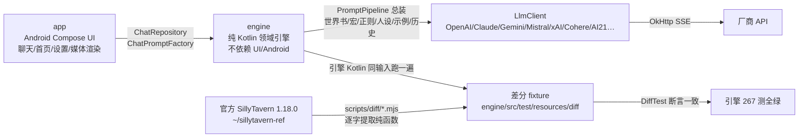

# 交接清单（会话上下文耗尽时使用）

> 最后更新：2026-08-10。接手顺序：第 0 节一眼看懂 → 1 常用命令 → 2 差分怎么用 → 3/4 现状 → 5 剩余工作 → 6 日志。

## 0. 一眼看懂：这是什么、怎么保证 1:1



- 一句话：**App 只做“调用引擎 + 渲染”，引擎和官方 SillyTavern 1:1，UI 层自由**。
- “差分”= 同一输入，官方 JS 与引擎 Kotlin 各跑一遍，输出必须逐字一致；fixture 由脚本生成、不许手改。
- 官方基线：release `8172dcd`（SillyTavern **1.18.0**）；酒馆更新后重跑 `node scripts/diff/*.mjs`，红的就是要移植的差异。

## 1. 项目与常用命令

- 项目：EmberInn（余烬酒馆）——原生 Android SillyTavern 兼容客户端
- 本地：`/data/data/com.termux/files/home/ember-inn`；远程：github.com/heikeyangle-code/ember-inn（main，公开）
- 官方源码参照：`/data/data/com.termux/files/home/sillytavern-ref`（release 分支）

常用命令：

```sh
# 引擎测试（本机可跑：Java 21 + Gradle 9.7；App 编译只能靠 CI）
cd ~/ember-inn && ./gradlew :engine:test

# 改引擎/官方发版后：重新生成差分 fixture + 打包官方预设
node scripts/diff/*.mjs
node scripts/build-presets.mjs

# 推送（本机已 gh auth setup-git；网络不稳失败就重试）
git push origin main

# 看 CI：只有改 app/engine/gradle/工作流才自动触发；纯文档改动不会跑 CI
gh run list --limit 3
# 需要手工跑（比如只想验证一次）：
gh workflow run 328789880 --ref main
```

CI：`.github/workflows/build.yml`，两个 job：`engine-test`（:engine:test）与 `build`（单测 + assembleDebug + assembleRelease + 出 APK）。push 自动触发条件见工作流 `on.push.paths`；纯文档改动不触发。当前以 `gh run list` 为准。引擎本地 **281 测全绿**。

## 2. 什么是差分验证（新会话必读）

**目标**：EmberInn 是酒馆兼容软件，引擎逻辑必须和官方 SillyTavern 1:1。
“差分验证” = 同一输入，官方 JS 跑一遍、我们 Kotlin 跑一遍，输出必须一致。
手写期望值的单测只是自证；差分才是“官方说对才算对”的机器验证。

**怎么用**：
1. `scripts/diff/*-official.mjs` 从 `~/sillytavern-ref` 逐字提取官方函数，桩掉 DOM/全局依赖，生成 fixture：`engine/src/test/resources/diff/*.json`
2. `engine/src/test/.../*DiffTest.kt` 读 fixture，调 Kotlin 引擎逐例对比
3. 官方发版 / 我们改代码后：`node scripts/diff/*.mjs` 重新生成 fixture → `./gradlew :engine:test`
4. fixture 只能由脚本生成，不许手改；新功能先加 case 再实现

**已覆盖（60 组差分 fixture，共 961 例对拍，全部通过；2026-08-10 全量复算）**：
> 说明：历史日志里的“官方基准 8xx”是当时的累计口径，不等于 fixture 用例数；当前以 60 组 / 961 例（机器数）为准。

| 组 | 脚本 | 测试 | 例数 |
> 注：脚本数 60 个（prompt-converters 一行脚本输出 claude-messages.json）；合计 961 例。
| instruct 提示词 | instruct-official.mjs | InstructModeDiffTest | 36 |
| 世界书纯逻辑 | worldinfo-official.mjs | WorldInfoDiffTest | 19 |
| 世界书整体扫描 | worldinfo-scan-official.mjs | WorldInfoScanDiffTest | 17 |
| 世界书正则深度（regexDepth） | worldinfo-regex-depth-official.mjs | WorldInfoRegexDepthDiffTest | 40 |
| outlet 宏（{{outlet::key}}） | outlet-macro-official.mjs | OutletMacroDiffTest | 5 |
| 世界书文件 | worldinfo-file-official.mjs | WorldInfoFileDiffTest | 2 |
| 正则 | regex-official.mjs | RegexDiffTest | 20 |
| PNG 角色卡 | card-png-official.mjs | CardPngDiffTest | 6 |
| 宏 e2e | macros-official.mjs | MacroDiffTest | 158 |
| {{pick}} 确定性 | pick-official.mjs | PickDiffTest | 5 |
| 编辑器排序 | editor-sort-official.mjs | EditorSortDiffTest | 6 |
| 快捷回复自动执行选择 | auto-execute-official.mjs | AutoExecuteDiffTest | 4 |
| 向量工具函数 | vector-utils-official.mjs | VectorUtilsDiffTest | 14 |
| 角色卡 V2 归一 | char-v2-official.mjs | CharV2DiffTest | 5 |
| 世界书正则解析 | regex-parse-official.mjs | RegexParseDiffTest | 9 |
| 作用域宏内容裁剪 | macro-trim-official.mjs | MacroTrimDiffTest | 7 |
| Anthropic 请求体 | anthropic-body-official.mjs | AnthropicBodyDiffTest | 17 |
| Gemini 请求体 | gemini-body-official.mjs | GeminiBodyDiffTest | 16 |
| 聊天历史填充 | chat-history-pop-official.mjs | ChatHistoryPopDiffTest | 5 |
| 示例对话填充 | dialogue-examples-pop-official.mjs | DialogueExamplesPopDiffTest | 4 |
| YAML 角色卡导入 | yaml-import-official.mjs | YamlImportDiffTest | 5 |
| 提示词组装合并 | prepare-prompts-official.mjs | PreparePromptsDiffTest | 7 |
| CharX 角色卡导入 | charx-import-official.mjs | CharXImportDiffTest | 9 |
| BYAF 纯逻辑 | byaf-macros-official.mjs | ByafMacrosDiffTest | 14 |
| BYAF 聊天导入 | byaf-chat-official.mjs | ByafChatDiffTest | 5 |
| BYAF 角色卡组装 | byaf-card-official.mjs | ByafCardDiffTest | 4 |
| PromptManager 名字规则 | prompt-name-official.mjs | PromptNameDiffTest | 28 |
| 表情精灵引擎 | expression-engine-official.mjs | ExpressionEngineDiffTest | 19 |
| 表情分类文本预处理 | expression-classify-official.mjs | ExpressionClassifyDiffTest | 8 |
| 群聊成员激活 | group-activation-official.mjs | GroupActivationDiffTest | 15 |
| 群聊角色卡合并 | group-cards-official.mjs | GroupCardsDiffTest | 8 |
| 群聊深度提示 | group-depth-official.mjs | GroupDepthDiffTest | 7 |
| 精灵存储/Risu 导入 | sprites-storage-official.mjs | SpriteStorageDiffTest | 9 |
| 角色卡字段聚合 | character-fields-official.mjs | CharacterFieldsDiffTest | 8 |
| JSON 角色卡导入 | json-import-official.mjs | JsonImportDiffTest | 10 |
| BYAF 完整导入 | byaf-import-official.mjs | ByafImportDiffTest | 8 |
| 斜杠转义判定 | slash-escape-official.mjs | SlashEscapeDiffTest | 27 |
| 斜杠参数解析核心 | slash-parser-official.mjs | SlashParserDiffTest | 18 |
| 提示词工具 | prompt-utils-official.mjs | PromptUtilsDiffTest | 9 |
| JSON 角色卡导出 | json-export-official.mjs | JsonExportDiffTest | 6 |
| SSE 流解析 | sse-stream-official.mjs | SseStreamDiffTest | 16 |
| 正则整体管线 | regex-pipeline-official.mjs | RegexPipelineDiffTest | 10 |
| 导演备注 | authors-note-official.mjs | AuthorsNoteDiffTest | 7 |
| 人设引擎 | persona-engine-official.mjs | PersonaEngineDiffTest | 16 |
| 群聊完整循环 | group-loop-official.mjs | GroupLoopDiffTest | 11 |
| OpenAI 请求体（全厂商） | openai-params-official.mjs | OpenAiParamsDiffTest | 27 |
| 工具 token 预分配 | tool-budget-official.mjs | ToolBudgetDiffTest | 4 |
| ChatCompletionPipeline 计划 | chat-pipeline-official.mjs | ChatPipelineDiffTest | 5 |
| 媒体附件纯逻辑 | media-engine-official.mjs | MediaEngineDiffTest | 17 |
| 媒体内联（OpenAI） | media-inline-official.mjs | MediaInlineDiffTest | 7 |
| 媒体 token 成本 | media-cost-official.mjs | MediaCostDiffTest | 18 |
| 特殊协议请求体（Mistral/xAI/AI21/Cohere） | special-bodies-official.mjs | SpecialBodiesDiffTest | 23 |
| OpenAI 文本补全请求体 | text-completion-body-official.mjs | TextCompletionBodyDiffTest | 6 |
| BYAF 资源提取 | byaf-assets-official.mjs | ByafAssetsDiffTest | 6 |
| 提示词总装整链（prepareOpenAIMessages+populateChatCompletion，含工具/媒体/推理签名/continue-nudge 分支） | prepare-messages-official.mjs | PromptPipelineDiffTest | 20 |
| 媒体内容块转换（Claude/Gemini） | media-convert-official.mjs | MediaConvertDiffTest | 25 |
| 消息转换整链（Claude/Gemini） | prompt-converters-official.mjs | PromptConvertersDiffTest | 41 |
| 思考入提示词（PromptReasoning.addToMessage） | prompt-reasoning-official.mjs | PromptReasoningDiffTest | 7 |
| 消息缓存深度（Claude/OpenRouter） | prompt-converters-official.mjs | PromptConvertersDiffTest | 4+3 |
| 其余提供商转换器+合并+预算+OpenRouter | prompt-converters-official.mjs | PromptConvertersDiffTest | 61 |

**分支级覆盖审计与打桩登记（防漏机制，2026-08-08 起强制）**
- 规则：差分脚本内任何打桩/未覆盖分支，必须登记在本节 + 脚本头部注释；未登记即视为未完成，不许声称该分支 1:1。
- prepare-messages（总装整链，20 例（2026-08-09 补顶层 continue-nudge 非 prefill 用例，锁 PromptPipeline→ChatHistoryPopulator 的 cyclePrompt 透传））：populationInjectionPrompts 已用官方真函数；getExtensionPrompt(IN_CHAT) 恒空串（官方内置扩展源，Kotlin 同步为空）；preparePromptsForChatCompletion 用 fixture 注入的同一提示集合（该函数自身 7 例差分）；**工具调用历史 / 推理链（active_chain/since_last_user）/ 推理签名 / 媒体内联（list/gallery/data URL）已补端到端 8 例**，打桩登记见脚本头部：registerFunctionToolsOpenAI 空对象 → 工具预算预分配恒 1 token；setToolCalls tokens = JSON.stringify 长度/4（官方 tokenHandler 对象整体计数，两端同一近似）；getChat content 归一 `?? ''`；媒体仅 data: URL 内联且只记账，content 数组表示由 MediaInliner/MediaConvert 差分单独覆盖；群聊 selected_group、names_behavior、send_if_empty、预算溢出、squash 开关均已覆盖。in-chat 扩展合并的 order==100 规则由引擎单测锁（官方 getExtensionPrompt 恒空，差分无法覆盖）。
- SSE：运行时只有官方对拍的 SseChunkParser 一条路（逐字符、事件级 catch 跳过 = 官方平滑流语义、[DONE]/message_stop 收尾、reasoning 独立通道）；旧 SseParser 已删除（曾把 content:null 拼成字面 "null"）。
- **仍绕过 fixture 的部分**：prepareOpenAIMessages 的 chat→messages 构造循环（names_behavior 内容前缀、isSameModel 签名/推理过滤、media/invocations 从 extra 提取）由 fixture 直接注入消息对象绕过；Kotlin 侧由 App 的 ChatPromptFactory（JSONL → PromptMessage）按官方同名逻辑实现，接线点见 4.7/4.9。
- 其它脚本的历史打桩（Message/PromptManager/tokenHandler 等）均为“与 Kotlin 移植同语义”的显式桩，fixture 生成即对拍，登记在各自脚本头部。

**尚未做差分的**：网络/路由层（Mistral/xAI/Cohere/AI21/OpenRouter 请求体与响应解析用 MockWebServer 单测锁行为，转换器本身已逐字差分）；斜杠完整 parser（SlashCommandParser 依赖数十个模块与 DOM，无法逐字提取；转义判定 testSymbol 已差分 10 例，其余手写单测 + 源码对照）。
聊天重排/文件向量化主体（官方函数与 DOM/服务端焊死，无法逐字提取；其中纯函数 splitRecursive/trim 系列已差分 14 例）。
作用域宏配对逻辑（官方 MacroCstWalker 依赖 chevrotain CST 与 MacroRegistry，无法逐字提取；其中 trimScopedContent 纯函数已差分 7 例）。

**预设体系**：官方 `default/content/presets` 已打包进 engine resources（context 34 / instruct 38 / openai 1 / textgen 6 / novel 24 / kobold 6 / sysprompt 13 / reasoning 5，共 127 个），PresetLibrary 可加载；quick-replies 也打包。官方发版后跑 `node scripts/build-presets.mjs`。

## 3. 引擎进度（对照官方 release）

### 3.1 角色卡 ✅
PNG V2/V3（tEXt/ccv3）与 JSON 导入导出（官方也只导出 PNG/JSON）、CharX/YAML/BYAF 导入；JSON 导入 5 例 + JSON 导出 4 例（getCharaCardV2+unsetPrivateFields）、YAML 3 例、CharX 5 例、BYAF 14+5+4+4 例；V2 归一（readFromV2，官方差分 5 例 + 多轮补真 bug）、私有字段清理、JSON 导出（CharacterCardExporter）；PNG 字节级差分 6 例。
✅ 导入保留世界书回归锁（2026-08-10 WorldBookImportTest：JSON/PNG 导入后 data.character_book.entries 可读可解析）；✅ CharX 资源提取（引擎 CharXImporter.CharXAssets）；✅ BYAF 资源提取（getCharacterImages/getChatBackgrounds 官方差分 6 例：默认头像回退、字节去重、paths 合并、url-join 不折叠 ../）；✅ App 层资源入库（2026-08-09：CharX icon→头像 + seed 取色，background/voice 落盘 assets/ 并记入 CharacterRecord）；✅ URL 导入角色卡（HomeViewModel.importCardFromUrl + 首页 FAB 弹层，PNG/CharX/JSON 按 URL 后缀/魔数探测，对齐官方 content-manager importURL；第 129 轮复验）。

### 3.2 世界书 ✅（含 RAG 向量扩展）
buffer/matchKeys/getScore/parseDecorators、checkWorldInfo 整体扫描（含两段扫描、sticky/cooldown/概率）、深度/递归、分组评分、角色过滤、时间效果、多世界合并、装饰器/哈希、世界书文件导入导出、世界书↔角色书互转；正则在 BUILD 阶段接入扫描器。 ✅ 世界书 BUILDING PROMPT 正则深度已差分（第 136 轮：regexDepthOf 逐字提取官方表达式，40 例对拍）。
✅ 扩展字段已全接上（数据全量透传 + 行为）：
   - vectorized → RAG：WorldInfoVectorActivation（同步/检索/强制激活，对齐 vectors activateWorldInfo）+ VectorStore/EmbeddingProvider（OpenAI 兼容）；**FileVectorStore 磁盘持久化对齐官方 vectra.LocalIndex**（目录 root/source/collection/model + items.json，重启不丢；InMemoryVectorStore 仅测试/临时）；Scanner 通过 externalActivations 强制激活（跳过关键词/概率）
   - 向量扩展补齐：**VectorChatRearranger**（聊天历史重排，对齐 rearrangeChat：protect 保留最近 N 条、insert 条数、模板 Past events:{{text}}、position 映射 BEFORE_PROMPT→start/IN_PROMPT→end）+ **文件/Data Bank 向量化**（对齐 processFiles/ingestDataBankAttachments/injectDataBankChunks/retrieveFileChunks/vectorizeFile：分块 splitRecursive、overlap、chunk 检索注入）+ VectorTextUtils（splitRecursive/trimToEndSentence/trimToStartSentence/overlapChunks 官方 1:1）
   - automationId → 快捷回复自动执行：WorldInfoAutoExecute.resolve + AutoExecuteHandler（对齐 quick-reply AutoExecuteHandler，prevent 栈；选择逻辑 4 例官方差分）
   - displayIndex → 编辑器排序：WorldInfoEditorSort（对齐 sortWorldInfoEntries，6 例官方差分，抓出 length 方向 bug 已修）
   - addMemo → 官方核心从未读取，仅透传

### 3.3 宏 ✅（含作用域宏）
通用作用域宏（{{setvar::x}}content{{/setvar}}、{{#}} 保留空白、嵌套、trim+dedent，对齐 MacroCstWalker.processScopedMacros）；trimScopedContent 官方差分 7 例；!?~> flags 官方标 TBD 未实现（无需补）；配对逻辑依赖 chevrotain CST 无法逐字差分（源码对照+单测）。
核心宏 + 官方 e2e 差分 158 例；变量简写全运算符、{{if}}、{{trim}} 作用域、legacy 标记/冒号/空格参数、嵌套参数、字段宏、聊天/状态宏；{{pick}} 用 seedrandom@3.0.5 逐位一致（5 例）。
✅ {{outlet::key}} 宏（第 140 轮：官方 core-macros.js 逐字提取差分 5 例；App 把世界书 outletEntries 注入 MacroEnv.outlets，官方 NONE 位置不注入提示词、仅供宏读取；差分抓出空 key 未判空已修）；✅ MacroRegistry 动态注册/注销/解析；✅ 宏 flags（{{#}} 保留空白已随作用域宏实现）；✅ 角色字段已接线（2026-08-10：App ChatPromptFactory 按官方 MacroEnvBuilder 映射 character/system.model，{{description}}/{{chardepthprompt}} 等可用）；🟡 聊天/系统状态边界仍缺；!?~> 官方标 TBD 无需补。

### 3.4 斜杠 🟡
SlashParser（命名/无名/引号/转义/list 值/rawQuotes）+ SlashEngine（管道/闭包/双管道）、/pass /let /qr-arg、{{var}}/{{pipe}}/{{arg}} 状态宏、快捷回复执行器；SlashEscape（testSymbol 转义判定，STRICT_ESCAPING 奇偶反斜杠）官方差分 27 例。
✅ 2026-08-10 按官方 SlashCommandParser 逐字移植 tokenizer：parseCommand/parseNamedArgument/parseUnnamedArgument（split+splitUnnamedArgumentCount，/let、/setvar=1、/qr-arg=2）/parseQuotedValue/parseListValue/parseValue；STRICT_ESCAPING 完整语义（/parser-flag 可切换，影响后续命令解析）；REPLACE_GETVAR 官方新宏引擎下为 no-op（{{getvar::}} 由 MacroEngine 展开，已测）；rawQuotes 官方语义（整段到命令结束、保留引号）；注释（//、/#、块注释）与命令间普通文本丢弃；闭包转义（\{:）按官方消费反斜杠。
🟡 偏差：官方惰性闭包（传给命令对象）与 () 即时执行统一为即时求值（近似，闭包仍预解析）；命令数仍少于官方（UI 已能做到的不补；异步/生成类 /gen /genraw /trigger /inject /while 未实现，登记 P2）。第 130 轮补 /renamechat /getchatname /setinput /bg /impersonate（官方语义：renamechat 空名提示、setinput 文本进管道并写输入框、bg 无参返回/clear 清除/URL 路径近似、impersonate prompt 覆盖默认冒充提示；引擎占位 + App 动作 + 单测）。第 133 轮补 /persona-set（mode=lookup/temp/all 默认 all：先找人设、找不到回退临时用户名，对齐官方 setNameCallback）。第 141 轮补 /trigger（官方 triggerGenerationCallback 的 Generate('normal') 语义：最后一条用户消息→generate、最后 AI→continue；await 参数不等待，登记）与 /inject（官方 injectCallback：chat_metadata.script_injects 持久化、before/after→扩展提示 start/end、chat→in-chat 深度注入、none 只存不注入、scan=true 注入文本进世界书扫描、ephemeral 生成结束自动删除；返回注入 ID；filter 闭包与 await 未实现，登记）。 第 149 轮补斜杠异步执行器：SlashCommandDef.suspendCallback + SlashEngine.executeAsync（同步 execute 行为不变，runBlocking 兜底；闭包递归走异步）；/gen（官方 generateCallback：当前聊天上下文 + 提示，不落盘，length= 覆盖响应长度）、/genraw（官方 generateRawCallback：直接请求，system/prefill/length= 可选）已接；genraw 的 instruct/as/stop/trim 参数未实现，登记。注：官方 1.18 无 /while 命令，原登记误记已删。差分：参数解析核心 43 例 + testSymbol 27 例（scripts/diff/slash-parser-official.mjs / slash-escape-official.mjs 从官方逐字提取，SlashParserDiffTest/SlashEscapeDiffTest 对拍）；执行链/闭包/注释仍源码对照 + 单测（依赖 DOM/模块无法逐字提取）。

### 3.5 提示词组装 ✅（核心）
PromptManagerCore（默认/用户顺序、enabled、injection_trigger、preparePrompt original/groupOverride、mergeSystemPrompts）、PromptCollection、ChatCompletion 嵌套集合（预算/溢出/squash）、ChatHistoryPopulator、DialogueExamplesPopulator、扩展注入（summary/AN/vectors/chromadb/persona/未知扩展）、in-chat 深度注入、continue nudge/prefill、bias、control prompts（impersonate/quiet）、nsfw/jailbreak/用户相对提示、工具调用（tool_calls）、ToolLoopPlanner 递归决策（官方 RECURSE_LIMIT=5：shouldContinue/buildNextMessages/nextRecursionCount，单测 4 例；工具真正执行在 App 扩展注册表）、人设 IN_CHAT 注入；**✅ PromptPipeline 总装器**（官方 prepareOpenAIMessages+populateChatCompletion 1:1：示例解析 parseExampleIntoIndividual/setOpenAIMessageExamples、控制提示、continue prefill、pin 顺序、squash；整链官方差分 20 例；in-chat 深度注入（populationInjectionPrompts：order 降序/角色固定序/深度 splice/reverse）已用官方真函数，扩展合并 order==100 规则由单测锁（官方 getExtensionPrompt 恒空，差分无法覆盖））、作者注释组合（ANWithWI）；CharacterCardFieldsEngine 官方差分 6 例；PromptUtils 官方差分 9 例；AuthorsNoteEngine（默认值解析+ANWithWI）官方差分 7 例（默认 position 修正为官方 1）。
✅ 历史 reasoning 注入（第 135 轮：PromptReasoningEngine.addToMessage 官方 1:1 差分 7 例；App 总装时先过 REASONING 正则（isPrompt=true+depth）再注入；power_user.reasoning.add_to_prompts 默认关，设置→服务开关；continue 最后一条 prefix 不受开关限制，官方语义）；✅ 角色 system_prompt / 剧情后指令已真正进请求体（2026-08-10 第 79 轮修复：官方 script.js generate 传 systemPromptOverride/jailbreakPromptOverride，App 此前漏传——角色系统提示词从未生效；现按官方语义传 fields.system/jailbreak，且 chat_metadata 同名键优先）；✅ 每条历史消息过 preparePrompt 宏替换已补（对齐官方 populateChatHistory；ChatHistoryPrepareTest）；✅ 角色宏环境接线（2026-08-10：ChatPromptFactory env.character=CharacterFields(system/jailbreak/description/…/charDepthPrompt)+system.model，官方 MacroEnvBuilder 映射 1:1，{{chardepthprompt}} 等历史消息宏可用）；✅ names_behavior 已按真实官方修正：Message.fromPromptAsync 不复制 name（请求体只在 COMPLETION 模式带 name，且先 isValidName 再 sanitizeName——PromptNameSanitizer 28 例差分；2026-08-09 修正 DEFAULT 模式误带 name）；✅ 工具预分配 token、媒体内联、推理签名已补（整链差分 20 例）；多模态请求体已接（MediaInliner/MediaConvert 差分）；🟡 工具真正执行在 App 扩展注册表。

### 3.6 正则 ✅
RegexEngine + substituteRegex/宏替换 + 27 例差分（第 132 轮扩：g/首匹配、i/m/s、x/X/A/J/U 非原生 flag → new RegExp 抛错 → 脚本跳过、u 原生 flag 应用、重复 flags 回退整体正则——全部对照官方 regexFromString 1:1）；世界书 key 解析 parseRegexFromString 差分 9→15 例（第 132 轮扩：x/X/A/J/U 无效 → null、重复 flag → null，WorldRegexUtils 已补重复 flag 拒绝；u/y 原生 flag 仍为边界登记）；RegexPipelineEngine（getRegexedString：placement/markdownOnly/promptOnly/runOnEdit/minDepth/maxDepth/禁用扩展）官方差分 9 例；聊天消息正则已在扫描器接入（messageTransformer）。
✅ 该卡正则已接线（2026-08-10：CharacterCardEdit 读写 data.extensions.regex_scripts 官方 RegexScriptData）；✅ 存前应用（第 128 轮：sendMessageAsUser→USER_INPUT、saveReply→AI_OUTPUT（冒充→USER_INPUT 不落盘）、getFirstMessage→开场白 AI_OUTPUT，全部走 ChatPromptFactory.resolveRegexScripts 统一脚本集合；落盘文本已过正则，宏仍延后到总装，请求等价）；✅ 总装应用（第 127 轮：isPrompt=true + 官方 depth 公式，只跑 promptOnly 脚本——官方 coreChat.map 语义，普通脚本不再双应用；世界书内容过 WORLD_INFO 正则）；✅ 允许列表（第 127 轮：character_allowed_regex 存储 + 角色详情开关 + allowedOnly=true，scoped 默认不生效）；✅ 全局开关（第 134 轮：设置→正则“启用正则脚本”，写 disabledExtensions.regex 语义，关闭后存前/总装/编辑/世界书全位点跳过）；✅ preset 脚本存储/UI（第 146 轮：命名预设集保存/恢复/编辑 + preset_allowed_regex[openai] 允许开关 + 存前/总装/编辑/开场白全位点接线；App 无采样预设管理器，命名集为官方 preset 扩展 regex_scripts 字段的结构等价，登记）。

### 3.7 预设 ✅
官方 127 个预设打包 + PresetLibrary；quick-replies 打包 + 执行器。moving-ui（界面预设）未打包。

### 3.8 聊天 🟡
jsonl 基础 + BYAF 聊天导入 + continue nudge；**swipes 数据模型（App 层，对齐官方 `swipe_id`/`swipes[]`/`swipe_info[]`：ensureSwipes 初始化、syncSwipeToMes 同步、Generate('swipe') 追加、deleteSwipe、editMessage 写回）**。
✅ 聊天元数据（2026-08-10 第 79 轮）：官方 ChatHeader（chats/{id}.json chat_metadata）读写 + 字段覆盖（system_prompt/scenario/mes_example）+ 背景（custom_background）；✅ 书签（第 130 轮复验：ChatStore bookmarkNames/createBookmark/openBookmark，存档 chats/{id}-Checkpoint-*.jsonl + 最后 AI extra.bookmark_link，官方 saveBookmark 语义；UI 对话框 + 二次确认）；✅ 设置快照（第 144 轮：SettingsSnapshotStore 命名 zip 保存/恢复/删除 SharedPreferences + 提供商档案，对齐官方 user.js 设置快照语义；恢复后需重启 App 完全生效，登记）。

### 3.9 提供商 / LLM 客户端（引擎 1:1 审计）

**一句话结论**：OpenAI 兼容全家、Anthropic、Gemini（含预算自动推导）、Mistral、xAI、Cohere、AI21 路由全部接完（转换器均已差分移植，网络层用 MockWebServer 单测锁行为）；OpenRouter 已接媒体嵌入/推理签名/reasoning exclude，缓存标记待设置项；只剩 Vertex 服务账号认证未做。

| 提供商 | 协议路由 | 请求体 | 消息转换 | 媒体 | 预算/缓存/签名 | 模型列表 | 状态 |
|---|---|---|---|---|---|---|---|
| OpenAI | ✅ `/chat/completions` | ✅ 全厂商参数 27 例差分 | ✅ | ✅ MediaInliner 7 例差分 | — | ✅ `data[].id` | ✅ |
| Azure OpenAI | ✅ `deployments/{model}/chat/completions?api-version=2024-12-01` + api-key 头 | ✅ 同全厂商参数 | ✅ | ✅ | — | ✅ `value[].id` | ✅ |
| DeepSeek | ✅ `/beta/chat/completions` | ✅ | ✅（官方 sendDeepSeekRequest：postProcessPrompt semi_tools + addAssistantPrefix + addReasoningContentToToolCalls + reasoning_effort） | ✅ | — | ✅ | ✅ |
| Groq / Moonshot / MiniMax / 智谱 / 通义 / 硅基流动 / Z.AI / Fireworks / Perplexity / Custom / NanoGPT / Chutes / ElectronHub / SiliconFlow / o1 / Ollama | ✅ openai-compatible | ✅（各自厂商参数分支） | ✅ | ✅（OpenAI 媒体数组） | — | ✅ `data[].id` / 无端点时最小对话探测 | ✅ |
| Workers AI | ✅ `{account}/ai/v1/chat/completions` | ✅ | ✅ | ✅ | — | ✅ `result[].name` | ✅ |
| Anthropic | ✅ `/v1/messages` + x-api-key + anthropic-version | ✅ 17 例差分（thinking/tools/web_search/json_schema/beta/采样/verbosity/no-prefill） | ✅ `convertClaudeMessages` 整链 41 例差分，已接入 builder | ✅ `convertClaudePart` 25 例差分（image/text/video/audio → 块） | ✅ `calculateClaudeBudgetTokens` 已接入 LlmClient（SamplerParams.reasoningEffort 默认 auto；adaptive→effort 字符串/auto→不加 thinking） | 🟡 官方不发模型列表请求，用默认模型 | ✅ 差 tokenizer |
| Gemini AI Studio | ✅ `v1beta/models/{model}:generateContent?key=` | ✅ 16 例差分（generationConfig/thinkingConfig/tools/toolConfig/google_search/图像模态） | ✅ `convertGooglePrompt` 整链 41 例差分，已接入 builder | ✅ `convertGooglePart` 25 例差分（inlineData/分辨率） | ✅ `calculateGoogleBudgetTokens` 已接入 LlmClient（gemini-3 flash/pro→thinkingLevel，2.5→数字预算） | ✅ `models[].name`（过滤 generateContent） | ✅ 差 tokenizer |
| OpenRouter | ✅ openai-compatible | ✅（openrouter 参数分支 + transforms/plugins/reasoning.exclude/effort） | ✅ | ✅ `embedOpenRouterMedia`（audio+video）已接线 | ✅ `addOpenRouterSignatures` + `cachingAtDepthForOpenRouterClaude` + `cachingSystemPromptForOpenRouter`（SamplerParams 缓存开关/深度/TTL）+ DeepSeek `addReasoningContentToToolCalls` 全部接线 | ✅ | ✅ |
| Mistral | ✅ 专用路由 `/chat/completions` | ✅ body 差分 23 例含内（sendMistralAIRequest 逐字提取） | ✅ `convertMistral` 已接线 | — | — | ✅ | ✅ |
| xAI | ✅ 专用路由 `/chat/completions` | ✅（官方 sendXAIRequest 字段，reasoning_effort high→high/其它→low） | ✅ `convertXAI` 已接线 | — | — | ✅ | ✅ |
| Cohere | ✅ 专用路由 `/v2/chat`（官方 API_COHERE_V2） | ✅（官方 sendCohereRequest 字段：documents/tools/p/frequency/presence） | ✅ `convertCohere` 已接线 | — | — | ❌（无 models 端点，默认模型 command-r-plus） | ✅ |
| AI21 | ✅ 专用路由 `studio/v1/chat/completions` | ✅（官方 sendAI21Request 字段） | ✅ `convertAI21` 已接线 | — | — | ❌（无 models 端点，默认模型 jamba-large） | ✅ |
| Vertex AI | ❌ LlmClient 明确拒绝（需服务账号/项目配置） | 🟡 vertex 参数分支已差分 | Gemini 转换可复用 | ✅ | — | ❌ | ❌ 服务账号认证未做 |

其余要点：
- providers.json 数据驱动 **24 家**（新增 Cohere/AI21 专用协议条目；含智谱/通义/火山方舟），端点按官方 `src/endpoints/backends/chat-completions.js` 核对 + 2026-08 联网核实最新模型（OpenAI gpt-5.5/5.4、Claude opus-5/sonnet-5/haiku-4-5、Gemini 3.6/3.5-flash/3-pro、DeepSeek v4、Grok 4.3、Kimi k3、GLM-5.2、Qwen3.7、豆包 Seed 2.1、MiniMax M3 等）
- LlmClient 七协议路由：openai-compatible（/chat/completions）、Anthropic（/v1/messages）、Gemini（generateContent）、Mistral / xAI / AI21（/chat/completions）、Cohere（/v2/chat）；SSE 四格式（OpenAI delta 也覆盖 Mistral/xAI/AI21、Anthropic content_block_delta、Gemini candidates.parts、Cohere content-delta），流结束兜底 onDone
- **能力管道已全通**（ProviderRequestOptions）：tools/tool_choice（OpenAI 兼容全家 + Anthropic + Gemini + Mistral/xAI/AI21/Cohere/DeepSeek 各自官方形态）、json_schema 结构化输出（openai/mistral/xai response_format、ai21/deepseek json_object+hack 消息、cohere response_format.schema、Anthropic 强制 tool、Gemini responseMimeType/responseSchema）、Anthropic/Gemini web_search、Gemini requestImages/aspectRatio/imageSize/safetySettings
- 响应解析按协议取纯文本；Azure（deployments + api-version 2024-12-01 + api-key 头）、Workers AI（账户 ID + /ai/v1）专用 URL
- 模型列表拉取四种格式：openai data[].id / google models[].name（过滤 generateContent）/ workers result[].name / azure value[].id；无模型端点的提供商（Perplexity/自定义）用最小对话探测
- ProviderStore 多连接档案（profiles.json + activeId，旧 connection.json 自动迁移）
- 边界：GEMINI_SAFETY/VERTEX_SAFETY 由调用方桩/传参（差分 fixture 同样打桩）；`convertClaudePrompt` 遗留旧函数（仅 token 计数用）未移植；Claude/Gemini tokenizer 仍是回退 cl100k

### 3.12 表情精灵 ✅（引擎层纯逻辑）
- ExpressionEngine：文件名→标签（joy/joy-1/joy.expressive→joy）、图片元数据（fileName/title/imageSrc/isCustom）、分组排序（主文件优先、附加标记 additional）、chooseSpriteForExpression（fallback、多立绘随机、rerollIfSame、overrideSpriteFile）
- sampleClassifyText：去宏/引号/星号、短文本裁句尾、长文本首尾各 250 拼接、LLM 模式仅 trim（8 例差分）
- 官方差分 14+8+7 例（expressions/index.js + endpoints/sprites.js + utils.js 逐字对拍）；SpriteStorage 覆盖 spritesPath（含子目录/sanitize）与 importRisuSprites（提取/去重/删除字段）；DOM 显示/动画/LLM 分类 API 属 App/服务层
- 差分顺带修 VectorTextUtils.trimToStartSentence：JS substring 自动钳制长度，Kotlin 需 coerceAtMost（原实现会越界）

## 3.11 向量扩展（RAG 全量）✅（引擎层）
- 世界书 RAG（vectorized 同步/检索/强制激活）
- 聊天历史向量重排（enabled_chats / rearrangeChat）
- 文件 / Data Bank 向量化（enabled_files：分块、overlap、检索注入）
- 向量库：FileVectorStore（磁盘持久化，对齐 vectra 目录）+ InMemoryVectorStore（测试）；EmbeddingProvider：OpenAI 兼容 + BagOfGramsEmbedding（本地离线）
- 查询语义对齐官方：multiQueryCollection 全局 topK / queryCollection 单集合（hashes 不过滤阈值）
- ❌ 聊天摘要 summarize（P3，官方默认关）；本地 transformers 嵌入（Android 用 Ollama 替代，接口已留）；translate_files（P3）
- 扩展提示通过 ExtensionPrompt（3_vectors→vectorsMemory / 4_vectors_data_bank→vectorsDataBank）注入组装管线（ChatCompletionPipeline KNOWN_RELATIVE）
- 引擎测试 267 全绿（含重排/文件/分块/工具函数/作用域宏/YAML/JSON 导入导出/提示词组装合并/CharX/BYAF 完整导入/名字规则/表情精灵/分类预处理/群聊完整循环/精灵存储/角色卡字段/斜杠转义/提示词工具/SSE 流解析/正则管线/导演备注/人设引擎/OpenAI 请求体全厂商/工具预算/管线计划/媒体附件/媒体内联/媒体成本）

### 3.10 其它
- ✅ 群聊成员激活策略官方差分 15 例；✅ APPEND 角色卡合并 8 例；✅ 深度提示 7 例；✅ 完整循环纯逻辑（GroupLoopEngine）官方差分 11 例；✅ App 调度层（2026-08-10 第 84 轮：GroupStore/新建群聊/GroupScheduler 选人/合并卡/顺序生成/续写与重生成按最后成员）；✅ natural/pooled 激活（第 87 轮）+ 队列提示（第 87 轮）；✅ 深度提示 App 接线（第 90 轮：in-chat 扩展注入 + GroupDepthPromptsEngine）；✅ 自动续写（第 90 轮：shouldAutoContinue + /continue 链，默认关）；✅ 策略切换 UI（第 90 轮：新建群聊 + 聊天 ⋮ 群聊设置）；narrator 按官方 1.18 无独立模式关闭（/sys 旁白消息群聊可用）。✅ 作者注释、聊天元数据模型、TokenCounterFactory（OpenAI 精确 JTokkit）
- ❌ 服务层：TTS / STT / 图像 / 翻译（P3/P4）；向量引擎已齐，App 层接线待做

## 4. App / UI 进度

### 4.1 导航与返回手势 ✅
底部三 Tab（角色/聊天/设置）；聊天页、设置子页都接 BackHandler，系统返回键/侧滑返回逐级回退（聊天→列表、提供商详情→列表→设置主页）；Manifest 已开 enableOnBackInvokedCallback（Android 13+ 预测性返回动画）。README 守则第 7 条已落实。

### 4.2 首页（角色 Tab）🟡
品牌顶栏 + **全局搜索**（README 守则 8：角色名/描述、会话名/最后消息、世界书条目 key/content/comment、设置项；分组结果列表；世界书条目点击出详情弹层；设置项点击跳设置 Tab；空结果引导）、AI 对话置顶卡、最近聊过横滑、角色双列网格、FAB 导入（PNG/JSON/CharX）、长按菜单（置顶/新会话/字段/导出/删除）、删除二次确认、字段详情弹层、空状态引导、Toast 反馈。角色卡取色 seed 已存（avatar → Palette）。
✅ 角色字段编辑（README：分字段 标签+预览+点击展开编辑；保存改写 rawJson 并同步会话名）。
✅ 角色详情编辑页已完成（2026-08-10 复验修复，c8b22e4 起）：官方 v2 卡字段全集编辑（名字/描述/性格/场景/开场白/示例对话/系统提示/历史指令/深度提示/话痨程度/作者/标签/备用开场白管理）+ 世界书条目管理 UI（增删改/启停/常量/选择性）+ 删除/置顶/导出 JSON/一键开始聊天。本轮修复：depth_prompt/talkativeness 读写改到官方位置 data.extensions（旧实现写 data 顶层，{{chardepthprompt}} 读不到）；世界书读取兼容 data.character_book 与根级 character_book（历史卡）；保存只覆盖编辑字段、未知扩展字段（probability/vectorized/automationId/displayIndex/extensions 等）原样保留、v1（key/order/disable）归一 v2；新增开场白编辑行；布局上下留白加大、条目卡片化；“新增条目”弹层删除按钮误删第一条的 bug 已修；导出文件名用编辑后名字。字段读写抽为纯逻辑 CharacterCardEdit（App 单测 5 例）。
✅ 正则（该卡）UI 已做（2026-08-10：data.extensions.regex_scripts 官方格式读写 + 编辑弹层 + 聊天 USER_INPUT/AI_OUTPUT 位点接线，见第 75 轮；第 127 轮补“允许此角色应用该卡正则”开关，写官方 character_allowed_regex，默认关闭）；✅ 变量（该卡）UI 已做（data.extensions.emberinn_variables，README 自定义扩展，官方无 per-character 变量，见第 8 节不一致登记）；✅ 快捷回复（全局）已做（第 77 轮：按官方 Quick Reply 扩展做成全局 preset + 槽位，字段 mes/label/enabled/automationId/preventAutoExecute 完全复用官方 QuickReplySlot；设置→服务→快捷回复管理，聊天输入区快捷盘点击执行；per-character 快捷回复已删除，README 表述已改全局）；✅ 模型覆盖已做（2026-08-10 第 81 轮）；✅ 主题配方（第 82 轮，部分）：data.extensions.emberinn_theme_recipe（seed/background/shape/font/style/lockMode）读写 + 角色详情页“主题配方”卡片（seed 输入、背景选图/清除、形状/字体/风格/浅深锁定 chips、恢复全局）；聊天页背景 = 会话锁定 custom_background 优先、角色配方 background 回退；✅ 全局应用已做（第 92 轮：ThemeState + MainActivity 管线：浅深锁定/seed/形状生效；字体 source=系统衬线、lxgw 待字体包）；🟡 字体文件下载、风格档位映射未做（边界登记）。设置搜索深链已实现。
注：模型覆盖/主题配方官方角色编辑器无对应字段（模型覆盖官方是聊天级 #custom_model_id），但为 README 明确承诺的项目自定义角色级覆盖，属待办，非移除。

### 4.3 聊天页 🟡 v2（核心已接线 + 媒体 + 状态胶囊）
> 发送行为：官方 send_if_empty 已接（第 148 轮：最后一条 AI + 空输入 → 发送配置文本续聊，设置→服务→发送）。
> 现状：continue 走官方默认 nudge 路径（历史“新的在前”对齐 setOpenAIMessages）；思考过程走 onReasoning 独立通道（流式显示 + 生成后折叠卡片）；重新生成/继续只对最后一条 AI 生效；新角色空会话自动补 first_mes 开场白（第 133 轮起：alternate_greetings 一并进第一条 AI 的 swipes，对齐官方 getFirstMessage，可滑动切换开场白）。
消息流 LazyColumn + 气泡 + 自动滚底 + 输入框 + 发送；**PromptPipeline 总装流式发送**（角色卡/世界书/示例/历史全部引擎内完成，SSE 逐 token）；停止按钮 = 取消 OkHttp call 并保留已生成部分（官方 mes_stop）；重新生成 = 删最后 AI 回复、复用最后用户消息（option_regenerate）；继续生成 = 官方 mes_continue（移出最后 AI + continue 模式续写，流结束与原消息合并落盘）；复制 / 删除 / **编辑消息**（官方 updateMessage：isEdit 正则分位点 + 清/写 extra.bias，第 129 轮）/ **冒充**（官方 Generate('impersonate')：模型以 {{user}} 视角写草稿，流式进输入框、不落历史；引擎 type=impersonate 整链差分已覆盖）/ 长按菜单；最后一条 AI 常驻 4 键；清空会话二次确认；Markdown + 代码高亮（mikepenz m3/coil3/code 0.43.0，import 包名已对 0.43.0 源码 jar 逐一核实；聊天气泡内已收敛为聊天风样式）；未配置模型横幅 → **一键深链“提供商与模型”子页**（先退出聊天再切 Tab，不会被早退逻辑挡住）；顶栏返回 + 角色头像 + accent 角色名；系统返回 / 侧滑返回已修。聊天页布局按 README 重排：systemBars 留白、气泡限宽 78%、间距/圆角/留白加大、顶栏与输入栏为 Cloudy 0.7.1 真背板模糊玻璃（sky 源层 + cloudy 浮层，正文区不模糊）、空状态居中留白。
✅ 角色详情入口已接通（角色卡长按菜单“查看/编辑详情”→ 详情编辑页，见 4.2）。
❌ Claude 冒充的 assistant_impersonation 设置（默认空串，影响为 0，排 P2）。
✅ **滑动切回复已做（README #1731“每条消息都能滑”）**：数据模型对齐官方 jsonl（`swipe_id` / `swipes[]` / `swipe_info[]`，ChatStore.ensureSwipes 初始化 + syncSwipeToMes 语义同步 mes/send_date/gen_*/extra）；AI 气泡横滑（右=下一个/最后一条 AI 越界生成新变体，左=上一个）；计数条 `n/N` + CaretLeft/Right（有变体时显示）；长按菜单“上一个/下一个回复”“删除当前回复”（官方 deleteSwipe 的 newSwipeId 规则）+“生成新回复（变体）”（官方 Generate('swipe')：coreChat.pop() 排除最后一条，结果追加进最后一条 swipes 不新增消息）；编辑消息同步写回 swipes[swipe_id]（官方 editMessage）。导出 jsonl 含 swipes 字段可直接进酒馆。✅ 世界书扫描与官方一致（第 130 轮核对 script.js prepareMessages：swipe 在 coreChat.pop() 之后才 chatForWI=coreChat 扫描，App 的 dropLast(1) 等价，原登记“官方含最后一条”为误记，已更正）。
✅ 滑动切回复的 swipe picker（第 134 轮复验：长按菜单“变体列表”→ ModalBottomSheet，逐条显示当前高亮，点击即跳转并关层；数据/跳转/删除接口均已接线）。
✅ 上下文占比胶囊已达标（圆环+百分比+绿黄橙红分级+点开分解，分母=ConnectionProfile.contextWindow，设置页可配）；✅ 世界书状态已升级为命中面板（条目名/命中键/常驻/位置/token，点 pill 打开）。
⚠️ 快捷工具盘=“继续/冒充 + 全局快捷回复 chips”（第 77 轮）+ automationId 自动执行（第 93 轮：世界书命中条目 automationId 匹配槽位自动执行，prevent 栈 1:1）；图像生成/附件/TTS 已入快捷工具盘与长按菜单，全局正则开关在设置→正则页（第 134 轮，disabledExtensions.regex 语义）。✅ 聊天元数据（2026-08-10 第 79 轮）：chats/{id}.json 官方 ChatHeader 读写；chat_metadata.system_prompt/scenario/mes_example 覆盖角色卡（引擎参数已接）；custom_background 聊天背景（⋮ 菜单选图/清除，消息区低透明铺底）；✅ 书签（存档 + bookmark_link + 载入，第 130 轮复验）；✅ 设置快照（第 144 轮，见 3.8）。
现状补充：键盘适配（adjustResize + imePadding）、消息日期分隔（今天/昨天/日期）、删除消息二次确认、⋮ 会话菜单（导出聊天 JSONL / 清空）、发送按钮空输入禁用态、媒体附件与状态胶囊（见 4.8）。
近期修复（2026-08-09）：自动滚底=贴底跟随+上滑暂停+回底恢复；思考过程空正文时独立成卡不再消失；流中断保留思考+人话提示；世界书状态=命中面板（名字/键/常驻/位置/token）；上下文胶囊分母=contextWindow（默认按模型自动填，见 4.4）；SSE 事件级容错对齐官方平滑流（坏事件跳过不中断，差分 16 例 + MockWebServer 回归）；滚动跟随仅贴底时滚、发送复位；首页预览走 ViewModel 缓存（不再组合期读盘）；**滑动切回复全链**（swipes 数据模型 + 手势/计数/菜单 + 生成变体 + 编辑同步，对齐官方 ensureSwipes/syncSwipeToMes/Generate('swipe')/deleteSwipe/editMessage）。

### 4.3.5 聊天 Tab（会话列表）✅
全部会话按时间倒序、置顶优先；点卡片进聊天；长按 / ⋯ = 置顶 / 导出聊天 JSONL（官方格式，可直接进酒馆）/ 删除（二次确认）；FAB「+」新建对话（AI 对话或选角色，每个角色可开多个会话，UUID 会话 id）；空状态引导；会话置顶持久化（SessionRecord.pinned，兼容旧 JSON）。
✅ 新建群聊入口（第 134 轮复验：会话 Tab FAB → 勾选角色 → 新建群聊，GroupRecord + 群聊设置 UI 已接线；入口文案同步去“开发中”）。

### 4.4 设置 ✅（README 规格）
- 数据与隐私页已做实：导出全部数据（zip：角色/会话/聊天/头像/提供商配置）+ 数据位置透明展示 + 清除全部数据（二次确认，建议先备份）
- 首启引导已做实（README 启动体验）：欢迎页 + 导入角色卡（系统选择器直接导入）/ 直接开始聊天（进 AI 对话）/ 跳过；SharedPreferences 标记只显示一次；低饱和氛围渐变

- 设置主页：大标题 + 副标题、设置搜索（真过滤）、常用快捷区（主题/模型/语音/备份）、六组卡片（外观与主题 / 提供商与模型 / 语音 / 服务 / 数据与隐私 / 关于）
- 外观与主题：主题模式（跟随系统/浅色/深色）+ 六套预设主题（墨韵/青瓷/夜航/丹砂/琉璃/简约纸感），点选立即全局生效（实时预览），SharedPreferences 持久化；字体/圆角/背景模糊标“开发中”
- 提供商与模型（参照命理2 逻辑）：搜索 + 卡片列表（品牌 SVG 头像 + 名称 + 一句话 + 已配置/未配置 pill + “我的连接”切换/删除）；详情页 = 名称 / API Key（遮罩+显示）/ 接口地址 / 区域 / 账户 ID / API 版本 / 默认模型（底部弹层搜索）/ 上下文上限（tokens，占比胶囊分母）/ 最大回复 tokens（推理模型思考会占额度，512 太小正文被掐空；默认按 providers.json default_max_tokens）/ 测试连接 / 保存 / 删除确认
- 关于页做实：版本 0.1.0 / AGPL-3.0 / 数据仅本地 / 开源仓库
- 语音（TTS）✅（2026-08-10 第 80 轮执行层已接）：Android 系统 TTS 本机引擎，语音选择/语速/试听真实可用；朗读选项字段对齐官方 tts 扩展（enabled/voice/rate/auto_generation/narrate_user/narrate_by_paragraphs/skip_codeblocks/skip_tags/apply_regex）；聊天自动朗读（auto_generation）、消息长按“朗读这条消息”、narrate_user 已接；文本处理对齐官方（跳代码块/标签、去星号、正则 /pat/flags、去图片、按行分段排队），纯逻辑 TtsTextProcessor 单测 3 例；官方 1.18 无 STT，语音输入不假装（未做）
- 服务页 ✅（2026-08-10 第 86 轮执行层已接）：翻译（第 137 轮 8 家全实现：Libre/Google/Yandex/Lingva/DeepL/OneRing/DeepLX/Bing，协议对齐官方 src/endpoints/translate.js，Bing 按官方依赖 bing-translate-api 4.2.1 移植 token 流程；语言映射/DeepL formality/free-pro 端点均按官方；第 142 轮自动翻译模式已接：responses/both→AI 回复译文进 extra.display_text、推理进 extra.reasoning_display_text，inputs/both→用户消息 mes 换译文、原文存 display_text，渲染按官方 display_text ?? mes；编辑后按官方 translateMessageEdit 自动重译/清除 display_text（第 142 轮））、图像（第 138 轮：AUTOMATIC1111/SDCPP/NovelAI/OpenAI gpt-image/HuggingFace 已实现，协议对齐官方 stable-diffusion 扩展与 src/endpoints/{stable-diffusion,novelai}.js——SDCPP 同 /sdapi/v1/txt2img、NovelAI 请求体 1:1 且解 ZIP 取 PNG、HF 直连 /models/{model}；UI 增 API Key 字段；第 145 轮 Stable Horde 已实现（官方 horde.js：截断+sanitize+异步任务+轮询 check/status，默认 cfg_scale=7/512x512/karras/sampler=k_euler_a）；DrawThings 仅 macOS 本地服务，Android 不适用已从 UI 移除；ComfyUI 已做（第 150 轮：用户提供 workflow JSON（含 %prompt%/%model%/%steps%/%width%/%height%/%seed%/%denoise%/%clip_skip%/%vae%/%sampler%/%scheduler%/%scale% 占位符）→ POST /prompt → 轮询 /history → GET /view，官方 comfy.generate 1:1；官方默认 Default_Comfy_Workflow.json 不在仓库，由用户粘贴，登记）、向量（OpenAI 兼容嵌入 / 本地 BagOfGram）——✅ 2026-08-10 第 88 轮已接线：设置页开关（启用/聊天历史重排/文件数据银行 + query/insert/protect/阈值）、发送时 VectorChatRearranger 重排+数据银行检索、世界书 vectorized 条目经 externalActivations 强制激活、聊天 ⋮ 数据银行管理；OpenAI 配置不完整时本轮禁用并人话提示

### 4.4.5 应用图标 ✅
launcher 图标 = 用户提供的原图（Download/file_0000000078d0820782054bfedd4cb346.png）缩放为 mipmap-xxxhdpi/ic_launcher.png（192px），Manifest 引用 @mipmap/ic_launcher；换图只需替换该 PNG。

### 4.5 主题系统 ✅（全局层）
ThemePreset（seed/secondary/tertiary + 纸色/夜色）→ Theme.kt 自动生成整套 M3 ColorScheme（含 surfaceContainer 系列，浅色低饱和容器、深色提亮主色）；MainActivity 持有 themeMode/preset 状态，贯通 MainScreen → SettingsScreen → AppearanceScreen。
✅ 玻璃表面：聊天页顶栏/输入栏 + 首页顶栏已接 Cloudy 0.7.1（背板模糊 + 半透明 tint，GPU + 旧设备 CPU 降级）；1px 高光描边/内阴影与其余页面待铺开。
✅ 角色卡驱动主题管线（seed/形状/字体/浅深锁定，角色配方优先，全局兜底）；🟡 MeshGradient 氛围背景未做（README 可选）。

### 4.5.5 图标系统 ✅
全 App 图标已从 Material icons 换成 Phosphor Regular（24dp 网格 / 256 viewport / 圆头圆角），内置 32 枚官方路径 `app/src/main/java/com/emberinn/app/ui/icons/PhosphorIcons.kt`（由 `scripts/gen-phosphor-icons.mjs` 从 phosphor-icons/core 官方 SVG 生成，增图重跑脚本即可）。
备用 Maven 包：com.adamglin:phosphor-icon:1.0.0（六字重全量、API PhosphorIcons.Regular.X，Kotlin 2.0.21 构建）与 io.github.dev778g-me:phosphoricon-compose:1.0.5（拆分包）均可用（Android AAR 存在）；现选内置 32 枚是出于 APK 体积与精确可控，后续如需全量图标可换 adamglin 包。material-icons-core/extended 依赖已移除。
规范：默认 onSurfaceVariant、激活 primary、警示 error；冒充用 MaskHappy、继续用 CaretDoubleRight、删除用 TrashSimple（README 图标系统节）。

### 4.6 数据存储 🟡
角色卡 characters/*.json + avatars/*.png、会话 sessions/*.json（含 pinned 置顶字段）+ chats/*.jsonl、提供商 profiles.json、主题 SharedPreferences（README 计划是 DataStore，未迁移）。
✅ 提供商“已配置”状态用进程内 ProviderState 共享（设置页保存/切换/删除后刷新，聊天页订阅，不再每发必读盘）；仅进入聊天页时读一次盘兜底。
❌ Room 未引入。

### 4.7 App 接线时官方行为怎么接（源码对照，新会话先读这里）

> 原则：App 接线只做“调用引擎 + 渲染结果”，不再重写一遍逻辑。每项都注明官方源码位置，接 UI 时照官方行为实现交互，引擎函数已经 1:1。

| 引擎能力 | 官方源码位置 | App 接线点 |
|---|---|---|
| 流式渲染 | `public/scripts/sse-stream.js` + `public/scripts/openai.js` eventSource | LlmClient.streamChatCompletions → SseChunkParser → ViewModel 增量状态 → 消息流逐 token 追加；停止 = 取消 OkHttp call（官方 abortController）；流结束必须走 onDone 收尾（引擎已兜底） |
| 提示词组装 | `public/scripts/openai.js` prepareOpenAIMessages + populateChatCompletion + `public/scripts/script.js` generate | ✅ 引擎已接：PromptPipeline.prepare 一个入口出最终消息（世界书/宏/人设/AN/示例/历史/控制提示/工具调用/媒体/推理签名/squash，整链差分 20 例）；App 发送前调它 + 按协议走 ChatRequestBuilder / Anthropic / Google |
| 消息转换 | `src/prompt-converters.js` convertClaudeMessages / convertGooglePrompt / 其余厂商 | ✅ 已全接：Claude/Gemini 在各自 builder 内部；Mistral/xAI/Cohere/AI21 在 LlmClient 对应协议分支调用；OpenRouter 在 openai-compatible 分支先签名/媒体再序列化 |
| 工具/能力选项 | `src/endpoints/backends/chat-completions.js` 各厂商分支 + `public/scripts/openai.js` oai_settings | ✅ 已接：ProviderRequestOptions 承载 tools/tool_choice/json_schema/web_search/request_images/safety，LlmClient 按各厂商官方形态写入请求体；App 层把设置/工具注册表填进 options 即可 |
| 预算计算 | `src/endpoints/backends/chat-completions.js` sendClaudeRequest / getGeminiBody（调用 calculateClaudeBudgetTokens / calculateGoogleBudgetTokens） | ✅ 已接：LlmClient 按模型/effort 调两个预算函数，结果传进 builder 的 reasoningBudget（adaptive→effort 字符串、auto→不加 thinking、数字→budget_tokens/thinkingBudget） |
| Markdown 渲染 | 官方用 Showdown + highlight.js + DOMPurify | mikepenz multiplatform-markdown-renderer + Highlights/KodeView；✅ HTML 消息开关 / Mermaid WebView 兜底（第 143 轮硬化：mermaid.min.js 本地资源离线渲染、第 177 轮放开网络与外链（远程图片/资源可加载、http(s) 链接走系统浏览器，不加开关）；第 178 轮 JS 全开、sanitize 只拦 javascript: URL（用户要求活动页/交互页面能跑，官方 DOMPurify 禁脚本，已知偏差，风险登记见 178）） |
| 媒体渲染 | `public/scripts/openai.js` Message.addImage/addVideo/addAudio + `public/scripts/media.js` | 聊天消息 `extra.media` → MediaEngine.getFromMime 判定类型 → 图片/GIF 用 Coil3（coil-gif）、音视频用 Media3 ExoPlayer；URL 附件按官方逻辑下载/展示；✅ extra.media 解析与渲染组件已接（见 4.8） |
| 世界书注入 | `public/scripts/world-info.js` checkWorldInfo + `public/scripts/openai.js` | 发送前：世界书条目 → Scanner（含正则 messageTransformer、RAG 强制激活）→ 注入结果进 PromptAssembler；命中灯只读 Scanner 完整 match 结果 |
| 宏 | `public/scripts/macros/engine/` | 所有文本入 prompt 前统一走 MacroEngine（世界书 format、作者注释、历史消息 preparePrompt 已由引擎接线，App 只需保证 MacroEnv 提供聊天/角色/系统状态） |
| 正则 | `public/scripts/regex/` | 存前（sendMessageAsUser/saveReply/getFirstMessage）+ 总装（isPrompt=true/depth）双位点接入 RegexPipelineEngine；允许列表 character_allowed_regex；设置页做 global/preset/scoped 分桶（preset 存储待做） |
| 群聊 | `public/scripts/group-chats.js` | 每轮：GroupActivationEngine 选成员 → GroupCharacterCardsEngine 合并卡字段 → GroupDepthPromptsEngine 深度提示 → GroupLoopEngine 判定续写/生成类型 → 多人回复按官方顺序拼接 |
| 表情精灵 | `public/scripts/expressions/` + `endpoints/sprites.js` | ExpressionEngine.chooseSpriteForExpression 选图 → sprite 渲染到消息头像区；分类 API 接 LLM 或本地模型 |
| 快捷回复 | `public/scripts/quick-reply.js` | 输入区快捷盘 → QuickReply 执行器（automationId 自动执行由引擎 WorldInfoAutoExecute 判定） |
| 人设 | `public/scripts/personas.js` | ✅ 2026-08-10 第 83 轮：PersonaStore（filesDir/personas.json，官方 Persona Management 语义）+ 聊天 ⋮ 人设选择/新建/编辑/删除；选中人设时 personaDescription 注入（personaInPrompt=true，官方 persona_in_prompt 语义；引擎 PromptPipeline 补同名透传参数，默认 false 行为不变） |
| 向量 RAG | `extensions/vectors/index.js` + `utils.js` | ✅ 2026-08-10 第 88 轮：VectorRagService（OpenAI 兼容 / 本地 BagOfGram + FileVectorStore）→ ChatPromptFactory 总装前跑 VectorChatRearranger（聊天重排/文件分块/数据银行检索，引擎 1:1），世界书命中经 scanner externalActivations 强制激活，扩展提示 3_vectors/4_vectors_data_bank 注入；数据银行文件在聊天 ⋮ 菜单管理 |
| 作者注释 | `public/scripts/authors-note.js` | AuthorsNoteEngine.resolve 每 N 条消息刷新，ANWithWI 合并世界书结果后注入 |
| tokenizer | `src/tokenizers.js` | TokenCounterFactory：OpenAI 用 JTokkit；Claude/Gemini 目前回退 cl100k，P2 换官方 web tokenizer |
| 提供商设置 | `public/script.js` / `src/endpoints/backends/chat-completions.js` | ProviderStore（profiles.json）多档案；协议/URL/认证/模型列表全在 LlmClient，UI 只读写 ProviderSpec + ConnectionProfile |

### 4.8 媒体这轮覆盖盘点（引擎已做 / App 待做）

**引擎已做（差分全过）**：
- MediaEngine 17 例：media type / display / index 纯逻辑（含越界、NaN、null 回退）
- MediaInliner 7 例：OpenAI 消息 content 文本→数组、image_url/video_url/audio_url + detail 质量
- MediaConverter 25 例：Claude/Gemini 内容块转换（image/text/video/audio → Claude image/text、Gemini inlineData，media_resolution_low/high、JS split 边缘）
- 消息转换整链 41 例：convertClaudeMessages / convertGooglePrompt（媒体随消息走）
- 已接入请求体：OpenAI（ChatRequestBuilder）、Anthropic/Gemini（builder 内 toChatMLJson → 转换器）
- MediaTokenCost 18 例：getImageTokenCost（low→85、auto≤512→85、2048 缩放→768 短边→512 方格 170/格+85）、视频 263 tokens/秒（回退 263×40）、音频 32 tokens/秒（回退 32×300）

**App 层（2026-08-09 已接）**：
- ✅ 聊天消息 `extra.media` 解析（ChatPromptFactory → PromptMessage.media/mediaDisplay/mediaIndex）
- ✅ 媒体渲染组件：图片/GIF（Coil3 + coil-gif）、音视频（Media3 ExoPlayer 1.10.0 PlayerView）、发送前附件缩略图/移除
- ✅ 系统文件选择器（image/video/audio 多选）→ 落盘 filesDir/media/，聊天 extra.media 只存路径 + source:"upload"（官方 saveBase64AsFile 语义，chats.js 逐行核实：{url,type,title,source} / media_display / media_index）→ 发送时 ChatPromptFactory 读文件转 data URL（官方 fetch→base64 语义）→ 引擎链内联 + token 预算；渲染时路径/URL 都支持
- ✅ 上下文占比胶囊（圆环+百分比+绿黄橙红分级+点开分解，分母=contextWindow）+ 世界书命中面板（条目名/命中键/常驻/位置/token）
- ✅ 2026-08-09 根治“只思考无正文 / 继续生成不出内容”（此前 maxTokens 未传总装只是接线，真正根因两个一次修完）：
  - 引擎 1:1 缺口：官方 openai.js gpt-5 分支已移植——openai/azure_openai/openrouter 三源对 gpt-5 自动 max_tokens→max_completion_tokens，并按官方删不支持采样参数（gpt-5-chat-latest 删 tools/tool_choice；gpt-5.1–5.4 无 reasoning_effort 删 freq/pres；其余删 temp/top_p/freq/pres）；ChatRequestBuilder 增 source 参数接入 LlmClient 三个调用点，OpenAiParamsBuilder 同步镜像；差分 21→27 例。
  - 老档案默认值迁移：旧 profile 存 maxTokens=512 / contextWindow=8192（旧写死默认），运行时自动升为厂商默认（openai 16384）/ 模型窗口，不重进设置保存也生效。
  - providers.json 24 家补 default_context_window + model_contexts（gpt-5.5 272K / claude 1M / gemini 1M / deepseek 1M / grok-4.3 1M / kimi-k3 1M / glm 200K / qwen 262K / 豆包 256K 等）；上下文胶囊分母默认按所选模型，设置页显示“按模型自动”（手动改数字后退出自动）。
- ✅ 官方对齐项：附件落盘 filesDir/media/（非 base64）、extra.media {url,type,title,source:"upload"} + inline_image:true、删除/清空/删会话时清理附件文件
- ✅ 角色卡 extensions.assets（CharX）：icon→头像 + seed，background/voice 落盘 assets/ 并记入角色记录
- ⚠️ 图库切换已做（第 95 轮：发送端列表/图库切换 + 渲染横滑/圆点 + media_index 落盘）；✅ 从 URL 导入附件（第 131 轮：输入区附件菜单“从 URL 添加”→ 下载 → 落盘 media/ → 与本地附件同链，URL 后缀+魔数判型；官方 Message.addImage/addVideo/addAudio URL 来源）；未做（登记）：URL 型资产下载（图片发送前压缩 compressImage 已做近似：非 jpeg/png/webp 转 JPEG 最长边 2048）

### 4.9 App↔引擎接线状态
聊天链路（发送/停止/继续/重新生成/冒充/编辑/删除/媒体/思考）全部接到引擎 1:1 能力上；官方行为接线点明细不再单列，见 4.3/4.7 现状描述。
上下文预算对齐官方（commit `131d5c6`）：默认 32K（旧 8192 视为未设置）、maxTokens 钳制保证预算为正、
必选提示词装不下时走 `ContextBudgetException` 人话报错；Claude 直连缓存参数已接线（详见第 6 节日志 72）。

## 5. 完成度总览（截至第 150 轮 / 2026-08-10；第 127–150 轮增量见第 8 节半成品治理与各小节登记）

**第 127–150 轮新增完成**（全部 CI 绿、引擎 296 测全绿、差分 60 组 / 961 例）：
- 正则全链路（允许列表/存前/总装/编辑/世界书/全局开关/preset 命名集，127–129/132/134/146 轮）
- 群聊 gen_id 整批共享、备用开场白 swipes、书签/URL 导入/设置快照复验（129–131/133/144 轮）
- 翻译 8 家 + 自动翻译模式 + 编辑重译（137/142 轮）、图像 6 来源 + Horde + ComfyUI（138/145/150 轮）
- 向量 Data Bank 高级参数 + URL 上传（138/147 轮）、Mermaid/HTML WebView 硬化（143 轮）
- 斜杠：/renamechat /getchatname /setinput /bg /impersonate /persona-set /trigger /inject
  /gen /genraw + 异步执行器（130/133/141/149 轮）、send_if_empty（148 轮）
- 引擎：{{outlet::key}}、PromptReasoning、正则 flags、世界书正则深度（135/136/140/132 轮）

**剩余**：工具调用 App 注册表（官方 1.18 无内置工具，且需引擎响应侧 tool_calls 解析差分，框架性待做）、
表情精灵 App 层（需 sprite 存储/分类后端，官方为 extras/LLM API）。

**已完成（全部经 CI 验证 / 引擎测试全绿）**

**已完成（全部经 CI 验证 / 引擎测试全绿）**
- P0：会话列表/新建对话、流式/停止/重生成/继续/复制/删除/编辑/冒充/提示词总装、滑动切回复 + swipe picker、
  全局搜索 + 设置深链（含服务/正则/世界书/快捷回复/语音）、群聊调度层
- P1：角色详情编辑页（字段/世界书/正则/变量/模型覆盖/主题配方 + 导出分享/AI 生成背景）、聊天页（胶囊/命中面板/媒体/
  滑动/行高）、启动无黑屏/无图标（Splash 已移除）、数据与隐私、首启引导、TTS、翻译/图像执行层（Libre/DeepL/DeepLX/A1111/gpt-image）、
  向量 App 接线（聊天重排/世界书 RAG/数据银行）、默认采样参数、全局字体/圆角、作者注释、全局正则
- P2：SlashParser flags + 常用/消息类斜杠命令 + 差分 18→43 例；群聊全部可做项（natural/pooled、深度提示、
  自动续写链、策略 UI）；世界书设置 UI；快捷回复 automationId 自动执行；JSON 导入导出差分 10→13/6→10；
  正则分桶差分 7 例；世界书深度注入/EM 锚点接线 + 负深度回归；HTML/Mermaid WebView；平板双栏；
  图库 LIST/GALLERY
- P3/P4：主题全局管线（浅深锁定/seed/形状/字体）、配方导出/分享、无障碍基础达标

**延迟/边界**：完整清单见第 8 节（不一致登记）与第 9 节；仅保留用户决策项——Claude/Gemini 官方 web tokenizer 用户明确豁免（cl100k 回退，只影响估算精度）。

**差分跟进（机制就绪，官方发版时执行）**
- 官方发版 → `node scripts/diff/*.mjs` + `node scripts/build-presets.mjs` → `./gradlew :engine:test`
- 60 组差分 fixture / 961 例对拍全绿（slash-parser 43、regex-scope 7、regex 27、regex-parse 15、json-import 13、json-export 10 等）

## 6. 引擎差分/修复日志（仅引擎层；App/UI 层不记过程，现状见第 4 节）

> 只保留会影响后续工作的结论；更早逐轮完整历史见 `git log --oneline`。

## 8. UI 规范审计（第 151 轮，对照 README 逐屏核查）

**已达标**：底部三 Tab + 平板双栏（NavigationRail）、首页（毛玻璃顶栏/全局搜索/AI 对话置顶/最近聊过/双列网格/卡片 seed 底色/最近消息预览/⋯入口/空状态双按钮）、Onboarding（淡入/两主选项/跳过/本地数据）、聊天页（流式/停止/滑动切回复+变体弹层/最后一条常驻 4 键+沉浸开关/上下文胶囊/世界书命中面板/快捷工具盘/书签/TTS/媒体渲染/Mermaid+HTML WebView/设置搜索深链）、设置六组卡片+常用快捷区、角色详情分字段编辑+模型覆盖收起+主题配方、无障碍 contentDescription、Phosphor 图标统一、无 Material 图标混用、无黑屏启动。

**本轮修复**：
- Token 统计菜单（README 消息操作表；长按 → 弹层显示当前模型 tokenizer 估算值）
- 外观新增四项：气泡样式（纸面/气泡）、密度（舒适/紧凑）、背景模糊总开关（关掉后顶栏/输入栏/首页顶栏用纯色表面）、启动进入上次聊天（默认关；MainScreen 持久化 last_session_id）
- 首页顶栏背景模糊开关同步生效

**登记未做（README 要求但未实现）**：
- LaTeX 渲染（KaTeX 资产未打包）；MeshGradient 氛围背景（API churn，用 seed 低饱和渐变替代中）；
  每卡“消息样式”配方（引用色/斜体色）；快捷回复全屏编辑器（现有管理页可编辑，非全屏）；网络代理（P5）。
- 骨架屏 / 触觉 / 空状态 / 彩色阴影 / 霞鹜文楷下载 / 六主题间距+动效 已落地（第 158-161 轮，见下节）。

## 8. 消息区布局调整（第 153 轮，OmniBot 对照 + 官方复核）

对照 omnimind-ai/OmniBot 的 ChatScreen/MessageBubble 借鉴（UI 思路，代码自研）：
- AI 消息全文宽（无边距纸面流），用户消息右对齐限宽 78% 整块气泡
- 消息留白节奏：用户消息顶部间距加大（user≈20dp / ai≈8dp 的呼吸感）
- 图片附件按官方复核后对齐（不用 OmniBot 瓦片方案）：
  官方 `.mes_img` 为内联大图（max-width:100%、max-height:40vh、圆角 5px），
  点击图片在 LIST ↔ GALLERY 间切换并持久化 extra.media_display（官方 chats.js
  switchMessageMediaDisplay）；App 恢复内联大图（高限 320dp）+ 点击切换 + gallery 左右滑切

## 8. 外观与主题页重构（第 157 轮，用户反馈 bug）

- 重叠根因：2 列 LazyVerticalGrid 混全宽项 + FilterChip 单行放不下溢出
- 修复：主题模式/圆角/字体/气泡样式/密度改用 FlowRow 自动换行；HTML/沉浸/选项块统一包进
  18dp Surface 卡片（surfaceContainerLow + 一致内边距），消除重叠与样式混乱
- 主题选中态根因：MainActivity 调 MainScreen 时漏传 themeMode/themePreset（只用默认值），
  导致全局主题已切但页面选中指示不动；已改为把真实状态传入 MainScreen（单一数据源），
  并删除页面本地兜底状态，避免双份状态漂移

## 8. 流式渲染/自动触底对齐官方（第 156 轮，对照 StreamingProcessor + scroll 逻辑）

官方流式（onProgressStreaming + Stopwatch(1000/streaming_fps=30)）：
- 每 tick 整段 messageFormatting；App 对齐：流式显示 30fps 节流（snapshotFlow 33ms 限流，结束时补最终值）
- 官方流式中补齐未配对定界符（* / " / ``` / ~~~，奇数时行尾补，多字符前加换行）→ 移植
  balanceStreamingDelimiters，显示前再过 fixMarkdown + encode_tags（与 messageFormatting 同链路）。
  ⚠️ 2026-08-10 复核：官方 1.18 源码（sse-stream.js / streaming-display.js / script.js）**并无**
  balanceStreamingDelimiters 函数，此为 App 层显示增强，非 1:1；规则定为“奇数且行尾未以该
  定界符结尾才补”，避免把“你好*”补成“你好**”（第 159 轮与单测对齐）。
- 落盘仍用原始流式文本（官方 saveReply 最后 cleanUpMessage，不落补齐痕迹）
官方自动触底：|scrollHeight-clientHeight-scrollTop|<5；用户上滑→scrollLock 暂停，回底→恢复；
App 贴底判定=最后一项可见，语义一致（上滑暂停/回底恢复已实现，本轮未改）
- 登记：auto_scroll_chat_to_bottom 开关（官方默认开，App 恒开）、cleanUpMessage 停用词逐 token 裁剪未做

## 8. 文字渲染对齐官方（第 155 轮，对照 script.js messageFormatting）

官方显示管线：显示位点正则（isMarkdown=true，仅 markdownOnly 生效）→ fixMarkdown(forDisplay=true)
→ encode_tags（可选）→ 引号转 <q> → Showdown → DOMPurify。App 对齐项：
- ✅ 显示文本走 vm.displayTextOf：显示位点正则（用户/旁白/AI 分位点 + 官方 depth）+ fixMarkdown
  （power-user.js 1:1 移植，含配对符号去空格、奇数 * / " 行尾补齐）+ encode_tags（默认关，外观新增开关）
- ✅ 复制/编辑仍用原始落盘文本（菜单 textOf），显示与操作分离
- 登记未做：引号转 <q>（视觉样式）、流式 30fps 节流（官方 streaming_fps=30，我们逐 delta 重渲染）、
  DOMPurify 白名单（WebView 简易消毒近似）、LaTeX、Showdown 的 emoji/underline/dinkus 扩展差异

## 8. 输入栏按钮借鉴 OmniBot（第 154 轮）

对照 chat_input_area_composer.dart 的按钮体系：
- 主行图标按钮 42dp → 36dp，颜色统一 onSurfaceVariant(0.8)，不再又大又平
- 发送按钮改实心圆钮：可发送时 accent 底 + 亮度自适应图标（浅色 accent 用深图标、深色用白），
  不可发送时 surfaceContainerHighest 浅灰；停止生成改 error 实心圆钮
- 输入框最小高 46dp → 44dp（OmniBot 紧凑 44dp）
- 快捷工具盘文字按钮、状态胶囊/待发缩略图暂保持，待下批继续统一

## 8. 角色详情页 UI 重构（第 152 轮，用户反馈）

- 世界书条目不再默认全展开：收进一张“世界书”卡片、默认折叠，点击展开/收起，放到详情页最底部
- 详情页所有分组统一为 SectionCard（基础字段/备用开场白/正则/变量/模型覆盖/主题配方/高级/世界书），
  统一 18dp 圆角 + surfaceContainerLow + 一致内边距，消除此前各组样式混乱
- 修复返回手势：详情页缺 BackHandler，系统返回/预测性返回会直接退出 App；已补 BackHandler(onBack)，
  与 edgeSwipeBack 并存，返回上一层的逻辑不变（MainScreen onBack = openDetailId=null）

## 8. 半成品治理记录（第 137–139 轮，2026-08-10）

针对“UI 有入口/执行没实现、字段没暴露、文档滞后”的半成品逐项核对官方源码并补齐：

| 项 | 之前 | 现在（第 137–139 轮） |
|---|---|---|
| 翻译执行层 | UI 8 家、执行 3 家；自动翻译模式只有选项没接线 | 8 家全实现（协议对齐 src/endpoints/translate.js；Bing 按官方依赖 bing-translate-api 4.2.1 移植 token 流程）；自动模式 responses/inputs/both 已按官方位点接线（第 142 轮） |
| 图像执行层 | UI 8 来源、执行 2 家 | A1111/SDCPP/NovelAI/OpenAI/HuggingFace/Stable Horde 已实现（第 145 轮 Horde 对齐官方 horde.js 异步轮询）；DrawThings 仅 macOS 不适用已移除；ComfyUI 仍标“开发中” |
| 图像 API Key | 无字段 | 设置→服务→图像新增 API Key（NovelAI/HF/Horde 用） |
| 向量 Data Bank 高级参数 | 官方默认隐藏 | sizeThresholdDb/chunkCountDb/overlapPercentDb 已暴露（默认 5/5/0，接进 VectorChatSettings） |
| 群聊入口文案 | “开发中” | 已实现并去文案 |
| swipe picker / 书签 / URL 导入 | 文档标未做 | 复验已实现并更正文档 |
| 死代码 | openComingSoon 未使用 | 已删除 |
| 快照 | 未做 | ✅ 设置快照（第 144 轮：命名 zip 保存/恢复/删除设置+提供商档案，官方 user.js 语义；恢复需重启，登记） |
| 预设正则 | preset 恒空 | ✅ 命名预设集 + 允许列表 + 全位点接线（第 146 轮，结构等价官方 preset 扩展字段） |
| 数据银行 URL 上传 | 仅本地文件 | ✅ 从 URL 添加（第 147 轮，官方 vectors Data Bank URL 上传语义） |
| ComfyUI | 开发中 | ✅ 用户 workflow + 占位符 + /prompt + /history + /view（第 150 轮，官方 comfy.generate 1:1；默认 workflow 文件官方仓库无，登记） |
| send_if_empty | 未做 | ✅ 空输入且最后一条为 AI 时发送配置文本续聊（第 148 轮，官方 oai_settings.send_if_empty） |
| 斜杠异步命令 | 无异步执行器 | ✅ executeAsync + /gen /genraw（第 149 轮；官方无 /while，误记已删） |

**剩余已知半成品（继续治理中）**：工具调用 App 注册表（官方 1.18 无内置工具，框架性待做）、表情精灵 App 层。

## 8. 与官方不一致登记（2026-08-10 全量审计，防漏机制）

> 规则：任何与官方 1:1 有出入的实现必须在此登记；未登记即视为未完成。

| 功能 | 与官方的差异 | 状态 |
|---|---|---|
| 斜杠执行链 | 官方惰性闭包（传给命令对象、可延迟执行）vs 引擎闭包预解析立即执行；`/if` 的 then/else 闭包同样预解析为文本（官方惰性）；命令数少于官方（第 130/141/149 轮补 renamechat/getchatname/setinput/bg/impersonate/trigger/inject/gen/genraw；官方无 /while）；`/parser-flag REPLACE_GETVAR` 在官方新宏引擎为 no-op（已对齐） | 近似已登记，见 3.4 |
| 斜杠参数解析核心 | parseCommand/parseNamedArgument/parseUnnamedArgument/testSymbol 已机器差分 18+27 例 1:1；执行链依赖 DOM/闭包无法逐字提取 | ✅ 差分 |
| 正则（该卡） | 存储/字段/位点同官方（data.extensions.regex_scripts、RegexScriptData、USER_INPUT=1/AI_OUTPUT=2/SLASH_COMMAND=3/WORLD_INFO=5）。✅ 存前应用（第 128 轮）；✅ 总装 isPrompt=true 只跑 promptOnly（第 127/128 轮）；✅ 编辑 isEdit（第 129 轮）；✅ 允许列表（第 127 轮）；✅ 全局开关（第 134 轮）；剩余差异：①落盘文本宏未替换（发送时应用、请求等价，登记边界）；②preset 脚本存储/UI 已做（第 146 轮命名预设集，结构等价官方 preset 扩展字段；无采样预设管理器，登记） | 🟡 宏落盘 + preset 边界，见 3.6 |
| 变量（该卡） | 官方变量是全局/聊天 scope（/let、variables.js），**没有 per-character 变量**；App 存 data.extensions.emberinn_variables 为 README 自定义扩展，官方导入会忽略该字段 | 🟡 README 自定义 |
| 快捷回复 | 已按官方全局：QuickReplyPreset/QuickReplySlot（mes/label/enabled/automationId/preventAutoExecute）+ QuickReplyExecutor 1:1。差异：①官方多预设文件（data/default-user/quick-replies/*.json），App 单预设 filesDir/quick-replies.json；②UI 已编辑 automationId/preventAutoExecute（第 93 轮）；③点击槽位官方按命令类型处理结果，App 把文本输出填输入框（可改可发），/let 等无输出命令正确静默 | 🟡 存储/交互近似，见 4.2/4.3 |
| 角色详情保存 | 官方编辑器写 data.extensions.depth_prompt/talkativeness，App 同位置；App 保存时额外把 readFromV2 提升字段镜像回 root（官方仅导入时提升），保证导出/其它客户端一致，不冲突 | ✅ 兼容增强 |
| 世界书 UI | 官方是独立 World Info 面板（world_info 扩展），App 在角色详情页自绘增删改；数据格式（data.character_book.entries、v1 key→v2 keys 归一）与官方一致，未知字段保留 | 🟡 UI 自主（兼容层一致） |
| 角色 system_prompt / 剧情后指令 | 官方 script.js generate 传 systemPromptOverride/jailbreakPromptOverride；App 此前漏传（角色系统提示词从未生效）→ 已修（79 轮） | ✅ 已修 |
| {{bias}} 提示词 | 官方 getBiasStrings 从输入/最近用户消息 extra.bias 提取；App 此前不传 → 已修：提取 {{bias:...}} 并剥离宏、generate/swipe 注入、impersonate/continue 不注入（Handlebars 嵌套近似） | ✅ 已修 |
| chatCompletionSource | 官方 Claude 走 claude 分支（assistant prefill 等）；App 此前恒 openai → 已按 provider.protocol 传 claude | ✅ 已修 |
| 人设 personaDescription | ✅ 已接（2026-08-10 第 83 轮）：PersonaStore + 聊天 ⋮ 选择；App 选中人设即 personaInPrompt=true（官方默认关，语义一致）；官方还有 {{persona}} 宏可用 | ✅ |
| 扩展提示 extensionPrompts | 引擎支持 summary/AN/vectors；App 作者注释已接（第 105 轮：聊天 ⋮ 作者注释 + ANWithWI）；记忆 UI 未做（官方默认关） | 🟡 记忆 UI 待做 |
| 工具调用 | PromptPipeline 支持 canUseTools/toolBudget/推理签名；App 工具注册表未做（HANDOFF 已有登记） | 🟡 P2 |
| 世界书设置 | 已做（第 94 轮：设置→服务→世界书，深度/递归/预算/大小写/整词，改动即存并用于聊天扫描） | ✅ |
| 模型覆盖 / 主题配方 | README 角色页承诺；官方无角色级字段（模型覆盖官方是聊天级 #custom_model_id）；已实现存储+UI+聊天背景（第 81/82 轮），全局形状/字体/浅深锁定管线已做（第 92/106 轮）；配方导出/分享已做 | ✅ |
| 向量 / 数据银行 | 官方 Data Bank 是浏览器附件/URL 上传；App 存 filesDir/databank/ 本地文本（UTF-8）；✅ URL 下载已做（第 147 轮：数据银行对话框“从 URL 添加”，对齐官方 vectors 扩展 Data Bank URL 上传语义）；sizeThresholdDb/chunkCountDb/overlapPercentDb 已暴露 UI（第 138 轮，官方默认 5/5/0）；本地 BagOfGram 为离线兜底（无官方对应） | 🟡 存储/交互近似 |

## 官方对齐确认总表（2026-08-10 全量审计结论）

**已逐字/差分确认对齐（官方源码 1:1）**
- 媒体内联能力：isImage/Video/AudioInliningSupported 白名单 + source 分支（差分 24 例）
- 世界书：externalActivations 键 world.uid、负深度、深度注入、EM 锚点、coreChat 过滤 is_system、
  ensureSwipes（只排除 user/isSmallSys、swipe_info 回填 extra={}）
- 斜杠：解析器 43 例差分、testSymbol 27 例；sendas 缺省 name 兜底当前角色名；/sysname 空名写 System；
  /hide=/message-role=is_system/narrator 语义；Comment 默认名 Note；/delswipe 1-based
- 消息数据流：AI 消息落盘带 swipes 结构；saveReply 尾部 mes/swipes/swipe_info.extra 逐字段刷新（continue 同步）；
  deleteSwipe 新 id 规则；syncSwipeToMes 字段；send_date=ISO；AI extra 恒有
  api/model/reasoning/reasoning_duration/reasoning_signature；群聊 AI 带 gen_id（第 129 轮起整批共享 group_generation_id）；
  普通用户消息 extra isSmallSys=false、无 gen_id；附件 media_index 恒写、inline_image=true
- 提示词：默认提示集合/顺序、populationInjectionPrompts、历史消息 preparePrompt 宏替换、
  AN interval 公式与默认 position=1、Generate 类型（regenerate/continue/swipe/impersonate）
- 正则分桶：GLOBAL→PRESET→SCOPED 顺序 + allowedOnly（差分 7 例）；JSON 导入导出（13/10 例）；
  slash-parser（43 例）；向量工具（14 例）等 57 组差分

**审计修复（bug/偏差已修）**
- 历史索引错位（media 挂错）、bias 提取最后用户消息 + 编辑存 extra.bias 回溯、
  /hide 语义、comment 不进提示词、系统消息防误操作（继续/重生成/变体/滑动）、
  continue swipe_info 同步、发送失败不丢输入、重生成先查配置、群聊配置实时、书签路径消毒、
  世界书条目删除确认、角色主题/背景实时刷新、平板导航轨、滑动返回手势、返回按钮不贴最高处

**登记边界（有意保留，非 bug）**
- extra.api 存提供商 id（官方存 source）；落盘文本未过 regex/宏替换（发送时应用，请求等价）；
  bias 文本提取 vs extra.bias（双轨已接）；
  /hide name 过滤、narrator/sendas bias-only is_system；SWAP/APPEND 旧版近似；
  openrouter/mistral 等模型元数据缺失回退；远程 URL 附件；
  表情精灵 App、Room/DataStore、插件 API、网络代理、视觉小说、STT、翻译自动模式、记忆摘要（官方默认关/远期）

## 8. UI 质感清单第一批/第二批落地（第 158–159 轮，2026-08-10，对照 EmberInn-UI质感提升方案）

**新增共享组件**（`app/src/main/java/com/emberinn/app/ui/components/`）：
- `EmberFx.kt`：EmberHaptics（Confirm/ToggleOn·Off/Reject/SegmentTick 语义触觉）、
  `Modifier.emberShadow`（Compose 1.9+ 稳定 dropShadow，阴影色用元素自身颜色深色版，非纯黑）、
  `EmberSkeletonBox`（rememberInfiniteTransition + 扫光渐变，颜色跟随主题强调色）、
  `EmberSwitch`（全 App 开关统一封装：ToggleOn/Off 触觉）
- `EmberEmptyState.kt`：中性空状态（可选图标 + 引导按钮 + 语气文案，无品牌符号/动画）

**第一批落地（6257134）**：
- 彩色阴影：首页 AI 对话卡（primary 光晕）、最近聊过（secondary）、角色卡（seed 色深版）全部换 emberShadow
- 触觉铺满：发送=Confirm、删除=Reject、开关=ToggleOn/Off、点角色/会话/新建/导入=SegmentTick 轻选；
  ChatScreen 原有 Confirm/Reject 保留
- 骨架屏：提供商模型列表“测试连接中”显示 5 行主题色骨架（替代灰色转圈）
- 空状态统一：首页/会话/聊天全部换 EmberEmptyState（中性图标 + 引导按钮，无品牌符号/动画）
- 声音反馈：已按用户要求整体删除（第 163 轮）

**第二批落地（bfda115）**：
- 六套预设主题各自形状性格：墨韵/青瓷=圆润 16dp、夜航/简约纸感=系统 12dp、丹砂=方正 4dp、琉璃=浑圆 24dp
  （ThemePreset.shape；角色配方 > 用户全局档 > 预设性格）
- 视觉氛围可调（vibe）：降饱和 / 冷暖 / 光效三项参数；预设=标准（无滤镜）、柔和、清冷、明快、自定义滑块；
  默认“标准”取色原样输出，无强制品牌气质（用户要求，见第 160 轮）
- 形状语言真正区分角色：角色卡按自身主题配方 shape 取圆角（square=4 / circle=24 / rounded=16 / 默认 16），
  与颜色一起形成每卡专属氛围

**第三批落地（d976515）**：
- 排版层级拉大：全局 Typography 标题 Bold/SemiBold、正文常规（README 清单 13）
- 空状态铺开：搜索无结果、全局正则空、快捷回复空、提供商模型列表空 全部换 EmberEmptyState（compact 行内模式）

**本轮 CI 修复**：
- ChatViewModel 补 DisplayPipeline/AppearancePrefs 导入；CharacterDetailScreen SectionHeader 补 @Composable
- DisplayPipelineTest 失败 → balanceStreamingDelimiters 补“行尾已以该定界符结尾则不补”规则（见上节登记）
- @file:OptIn 文件里 import 插到 package 前导致 CharacterDetailScreen 语法错误 → 已移回 package 后；
  EmberFx 移除错误的 ExperimentalUiApi file OptIn；SoundPool.load 改 absolutePath 字符串
- Switch→EmberSwitch 全局改名后，RegexScreen 里 `return@Switch` 标签不同步 → 已改 `return@EmberSwitch`（dbf321d）

## 8. 音效整套删除（第 163 轮，2026-08-11，用户要求）

- 删除 UiSounds.kt（SoundPool + WAV 合成）、MainActivity 初始化、EmberSwitch 切换音、
  ChatScreen 发送/删除音、首页/会话删除音、外观「交互音效」开关、AppearancePrefs.uiSounds 字段
- 触觉反馈保留（与音效无关）；README 清单 6 同步标记“已移除”

## 8. 酒馆官方默认值 + 选色盘 + 原生化（第 175 轮，2026-08-11）

- ThemePreset 新增官方字段默认值（null=跟随 M3）；酒馆官方主题填官方真值：
  body #DCDCD2 / em #919191 / underline #BCE7CF / quote #E18A24 / 用户气泡 #4D000000 /
  AI 气泡 #4D3C3C3C / 边框 #80000000 / 阴影 #80000000；用户设置留空时自动用主题默认
- 选色盘：新增 ColorPickerDialog（官方色板 + 20 常用色 + RGB 滑杆 + hex 输入 + 预览），
  消息渲染设置页每个字段改为“色块 + hex + 选色盘按钮”
- 原生化（减少 WebView 兜底）：<q>/<u>/<em>/<i>/<b>/<strong>/<s>/<hr>/<br>/<font color="#hex">
  和 Showdown ~text~ 全部预处理为原生 AnnotatedString 标记（引用色/下划线色/指定色），不再走 WebView；
  WebView 只留给 font rgb()/span/div/table/img 等真正解析不了的任意 HTML
- 兜底突兀度：WebView 已透明背景 + 官方 CSS 变量 + 自动测高 + 圆角裁剪 + 同字号行高

## 8. 聊天全链路流畅性（第 176 轮，2026-08-11，用户要求先搜同类问题再全链条排查）

**联网调研结论（Compose 聊天高频坑，已逐一对照本实现）**：
1. LazyColumn item 无稳定 key / 索引 key → 增删时 Compose 复用错位、触发错位动画 → 本实现流式项与最终消息共用 key 修复
2. `scrollToItem` 每 token 调用 / 首帧未测量被吞 → 首帧滚底改为读当前 layoutInfo，流式滚动与显示同频节流
3. 流式每 tick 整段 Markdown 重解析（mikepenz 官方 issue：LaunchedEffect 每次 cancel/restart，短流式 parse 全被丢弃）→ 本实现流式走轻量渲染，结束才完整解析
4. `animateItem()` + 索引 key 在流式结束“删一行插一行”时闪跳（Google issue 395536917/352584409）→ 流式项与完成消息同 key + 同 contentType，原地替换
5. WebView 在 LazyColumn 内高度突变会拽滚动（LemmyNet 案例）→ 已不在流式路径；HTML 消息仍走自动测高，登记为后续观察点

**已修（本机验证结构 + CI 验证中）**：
- **编译红修复**（HEAD 9319e68 实际会红的三处）：
  ChatMarkdown 的 `Markdown(...)` 参数列表里误插 `val stTheme/bodyColor/...` 且颜色用在声明之前 → 提升到函数头部；
  WebViewClient `onPageFinished` 改双参签名；MessageRenderScreen 字符串字面量裸换行 → 单行
- **流式输出降载**：显示节流 33ms→120ms（官方 streaming_fps=30 是上限不是目标）；
  流式中只 `balanceStreamingDelimiters`，不再每 tick `fixMarkdown`/`encodeTags`，结束后一次性走完整管线
- **流式轻量渲染 StreamingMarkdown**：AnnotatedString 一次构建（标题→粗体、**粗**、*斜*、~~删~~、~下划线~、
  `行内码`、六种引号对→引用色、链接→引用色），不启动 mikepenz 解析器；生成结束 ChatMarkdown 完整重渲染
- **滚动**：贴底跟随从“最后一项可见”改为滚动方向判定——长消息流式途中上滑阅读不再被拽回，
  滚回内容末端才恢复；流式滚动 120ms 节流；新消息/流式结束滚到消息底边；首帧滚底读当前布局总数
  （不再用组合期捕获的空 items，异步加载时也能一次到位）
- **列表 key**：Streaming/ReasoningOnly 与最终消息共用 `m-末尾索引` + contentType=`chat-message`，
  StreamingRow 去掉 `animateItem()` → 流式结束是内容原地替换，不再删行插行闪跳
- **每 tick 重算归零**：MessageRow 派生字段（media/name/time/swipe/displayText）`remember(el)` 一次缓存，
  dateLabel `remember`；items 构建不再依赖 streamingText（每 token 不再重建整表）

**登记（未做，观察后再说）**：WebView 兜底项高度突变仍是 HTML 长消息的潜在跳变源；若流式仍不够顺，
下一步可上 FluidMarkdown/增量渲染（支付宝开源）或把 120ms 再降到 150ms。

## 8. 扩展插件总开关 + 必要能力补齐（第 180 轮，2026-08-11，用户要求“一个主开关”）

**全网调研（tavernsprite 最佳扩展榜 / 小酒窝插件帖 / SillyTavern 扩展清单 / 酒馆助手文档）**：
- 常用插件 = 交互 HTML 卡片（Tavern Helper/HTML 注入器）、表情系统（Character Expressions）、VN 视觉小说模式、
  TTS/STT、记忆总结（Horae/Amily）、文生图、Quick Reply、追踪卡片（SimTracker/RPG Companion）、状态栏（Larson）、对话着色等
- 我们已有等价物：TTS（语音页）、文生图（服务页 A1111/gpt-image）、记忆（向量 RAG）、Quick Reply、对话着色（消息渲染字段）、主题背景（VN 类氛围）
- 决定：扩展区只做**一个总开关**（用户拍板），把最必要的卡片能力补齐；表情/VN/STT/EJS 变量等登记不实现

**已实现（commit 待推）**：
- ExtensionPrefs.interactiveCards + ExtensionsScreen（设置 → 扩展插件，一个主开关，默认开）
- 关闭总开关 → ``` 内 HTML 代码块不再转 iframe，按普通代码块原生显示
- 角色头像类 `.char-avatar`/`.char_avatar` + `{{charAvatarPath}}` 宏（对齐 Tavern Helper）：WebView 注入 CSS 背景图；
  角色头像从 MessageRow 传入（vm.avatarPath）；用户头像字段官方 Persona 无头像，暂空
- 原代码折叠：交互块上方 `<details><summary>原代码</summary>` 默认收起（对齐“启用代码折叠”）
- allowFileAccess=true 保证 file:// 头像可加载

**登记（未做）**：min-height: vh 换算；user 头像宏；Character Expressions/VN/STT；EJS/变量管理器（引擎层，需 JS 引擎+差分）；
后台脚本库（页面级自动化）；插件市场/扩展安装器

## 8. 交互代码块渲染器内嵌（第 179 轮，2026-08-11）

- 已内嵌“交互 HTML 卡片”渲染器（commit 560f251）：消息里 ``` 包着、内容像 HTML 的代码块 → 独立 iframe 运行，卡内脚本可交互
- 机制、对照源码、差分结论、能力对照、安全与许可证：全部见 **第 10 章 扩展插件（交互 HTML 卡片 / iframe 渲染器）**
- 本轮只记录结论：App 层实现，引擎未动；CI 以 560f251 为准

## 8. 交互页面全开 + 气泡关闭行为确认（第 178 轮，2026-08-11，用户明确“活动页=交互页面”）

**用户决定**：之前说的“能点的卡片/交互页面”就是活动页（带脚本的网页），全部放开，JS 开启。
- WebViewHtml 去掉 jsEnabled 参数，settings.javaScriptEnabled/domStorageEnabled 恒为 true（HTML 消息与 Mermaid 都开）
- sanitizeHtmlForWebView 缩减为只把 javascript: URL 替换成 blocked:（防卡片内脚本导航）；script/iframe/object/embed/link/on* 全部放行
- **安全风险登记（已知偏差）**：消息现在可运行任意 JS、可发网络请求；因没有 addJavascriptInterface/JS 桥，脚本碰不到 Android API 和本地文件（除 WebView 内的 asset）；官方 DOMPurify 禁脚本，此为有意偏差，后续若收紧先改这里
- 链接行为不变：http(s) 顶层导航仍走系统浏览器（shouldOverrideUrlLoading）；页面内 AJAX/轮播/弹层/表单等 JS 行为在卡片内正常

**网页式消息的嵌入表现（维护速记）**：
- 整条 HTML 套进我们注入官方字段 CSS 的最小页面壳，在透明 WebView 里渲染；消息自带的 <html>/<head>/<body>/<title> 被浏览器忽略，按“网页片段”显示
- 背景透明 + 圆角裁剪（12dp）+ 自动测高（onPageFinished 取 scrollHeight）；高度上限 420dp，超出后卡片内部自己滚动，不撑爆聊天列表
- 消息自带 <style> 可改整卡背景/颜色（全放开后的正常行为）
- 视频/音频 <video controls>/<audio controls> 可播放；无 controls 的不自动播
- JS 交互页（轮播、按钮弹层、表单）现在能跑；<a> 点击仍走系统浏览器

**气泡关闭时（气泡样式≠bubble）**：AI 消息直接走 ChatMarkdown 无 Surface 路径，WebView 仍透明底 + 自带圆角 + 自动测高，显示正常；combinedClickable 长按菜单不挡 WebView 内部触摸。用户消息始终是右侧胶囊气泡，不受影响。

## 8. Web 兜底全部放开 + 官方映射后处理（第 177 轮，2026-08-11，用户要求全放开不加开关）

**用户决定**：HTML 兜底不再拦网络/链接，全部放开，不加开关。
- WebView 删掉 shouldInterceptRequest（远程图片/字体/媒体可正常加载）；http(s) 链接 shouldOverrideUrlLoading → 系统浏览器打开（FLAG_ACTIVITY_NEW_TASK）
- JS 状态见第 178 轮：已全开（活动页/交互页面能跑），与官方 DOMPurify 禁脚本不同，登记为已知偏差 + 安全风险
- 兜底标签检测补齐：font/span/div/style/table/img 之外，新增 a/blockquote/ul/ol/li/p/pre/h1-6/center/figure/video/audio/button（这些官方永远渲染，不能因“HTML 开关关着”变纯文本）

**原生渲染架构升级：标记 + 最终 AnnotatedString 后处理（applyOfficialMarkers）**
- 旧方案在 annotator 的 TEXT 层逐段上色：引号对/<q> 标记在“引号内含 Markdown（如 "a *b* c"）”时会被 AST 拆成多个 TEXT 节点，标记失配 → 私有字符泄漏 + 不上色；<q> 内 <em> 也会被 em 色盖掉
- 新方案：preprocessOfficialHtml 只负责把 引号对/<q>/<u>/~text~/<font color> 转成私有标记 \uE001-\uE007；
  text 组件先 buildAnnotatedString（库的 buildMarkdownAnnotatedString + mdSettings）拿到完整 AnnotatedString，
  再 applyOfficialMarkers：剥标记字符（含 font 的 hex 段）、平移所有 span，按官方 style.css 层级上色：
  基础 em 色 → q 整段引用色（覆盖 em，等价 .mes_text q em { color:inherit }）→ u 下划线色+下划线（em 段避让，
  等价 .mes_text em 优先于 .mes_text u）→ font 整段指定色（等价 font[color] em/i/u/q { color:inherit }）
- 嵌套（引号内引号、font 内 em/u/q、u 内 em）用栈配对 + 层序解决；标记字符不会出现在最终文本里

**官方字段映射表（维护用）**
| 官方字段/语法 | 我们的实现 |
|---|---|
| 正文色 --SmartThemeBodyColor | 原生：ChatTypography body + markdownColor text |
| 斜体 <em>/<i> --SmartThemeEmColor | 原生：emAnnotator 斜体+emColor；引号/字体内的 em 按官方继承规则被外层色覆盖 |
| 下划线 <u>/~text~ --SmartThemeUnderlineColor | 原生：\uE003..\uE004 → 下划线色+Underline；em 段保留 emColor |
| 引用 <q>/引号对/blockquote/链接 --SmartThemeQuoteColor | 原生：\uE001..\uE002 → 整段引用色（含内部 Markdown）；blockquote 边框/链接色走 markdownColor/TextLinkStyles |
| <font color="#hex"> | 原生：\uE005..\uE007 → 指定色，覆盖 em/u/q（官方 font[color] 全部 inherit） |
| <font color="rgb(...)"> 等任意 HTML | WebView 兜底（透明底 + 官方 CSS 变量注入） |
| 表格/代码块/标题/列表/图片（Markdown） | 原生 mikepenz + Coil；HTML 版表格/图片等走 WebView |
| Mermaid | WebView + 本地 asset JS |
| 气泡底色/边框/阴影/毛玻璃 | 原生 Compose 卡片（MessageRow） |

**与官方 1:1 结论**：文本字段的映射与 style.css 逐条对齐；WebView 兜底是“官方 DOM 渲染的等价近似”。
**已知偏差（登记）**：
1. `<style>`：官方默认剥掉（需角色允许 custom-style 才恢复，选择器还加 .mes_text 前缀）；我们按用户“全放开”默认放行，且样式只影响该消息自己的 WebView
2. 外部媒体：官方默认 forbid_external_media=true（要设置才开）；我们按“全放开”直接允许
3. 官方页面级交互（click-to-edit、消息按钮、自定义样式按角色开关）未实现；消息内脚本官方禁、我们已放开（第 178 轮，风险登记）
4. 消毒原是白名单近似（DOMPurify 更细）；第 178 轮按用户要求全放开后只剩 javascript: URL 拦截

**边缘情况（已按官方语义处理/需回归）**：
- 引号内含粗体/斜体/下划线/代码：整体引用色，内部 u 仍下划线色，em 在 u 外/内按 CSS 层级
- 嵌套引号（不同引号类型）：栈配对，颜色一致
- font 内 em/u/q：整段字体色
- 代码围栏内的 HTML：looksLikeHtml 先剥 ```...```，不进 WebView
- encode_tags 开：< 先转义，HTML 不渲染（与官方顺序一致：先 encode 再 markdown）
- 半个标签/未闭合：looksLikeHtml 匹配到就整段 WebView，由浏览器容错
- 空消息/纯文本：不走 WebView，零开销
- WebView 高度突变仍是长 HTML 消息的潜在滚动跳变源（登记，观察）

## 8. 渲染全面对齐官方（第 174 轮，2026-08-11，逐条核对 script.js + style.css）

官方 messageFormatting（script.js）：引号对（"“«「『＂）→ <q>；Showdown：emoji/underline(~text~→<u>)/strikethrough/tables；
CSS（style.css）：i/em=emColor；q=quoteColor 且 q i/em inherit；u=underlineColor；a=quoteColor（不是下划线色）；
blockquote=左 3px quote + black30 底；body font-weight 500。

本次对齐：
- 原生：斜体（EMPH）→ emColor；引号对 → 引用色（自定义 annotator 的 TEXT 分支，含中英文引号）；
  链接 → 引用色（linkTextSpanStyle）；blockquote/checkbox 沿用官方样式
- WebView 兜底：<q>/<u>/<font>/blockquote/em/i 及 ~text~ 自动走官方 CSS（即使 HTML 开关关着，
  官方永远渲染 HTML）；a 色修正为引用色；em/i 恢复着色；q 内斜体继承
- 设置页提示修正：次要色=斜体+小字；下划线色含 ~text~；链接色=引用色

## 8. 官方字段设置页 + HTML 兜底修复（第 173 轮，2026-08-11）

- 新增设置页「消息渲染（官方字段）」：正文色/次要文字色/下划线色/引用色/用户气泡底/AI 气泡底/
  边框色/阴影色（#RRGGBB，空=跟随主题）+ 毛玻璃强度滑块（0-40，官方 --SmartThemeBlurStrength）
- 接入：
  - 原生 Markdown：正文色（markdownColor.text）、引用色（quote style color → blockquote 左栏）、
    自定义 blockQuote（黑 30% 底 + 官方内边距）、自定义 checkbox（引用色勾选框）
  - 气泡：用户/AI 气泡底 + 边框色（MessageRow）
  - 毛玻璃：顶栏/输入栏/首页顶栏 cloudy radius 走 blurStrength
  - WebView 兜底：注入官方 CSS 变量（body/q/u/em/a/blockquote/code）
- 修复 HTML 渲染不出来：根因是 WebView WRAP_CONTENT 在 Compose 里高度塌成 0；
  onPageFinished 测 scrollHeight 撑高，HTML 消息现在能正常显示
- 边界：行内 <q>/<u>/font[color] 依赖 HTML 兜底（WebView）；原生渲染里 em 颜色暂未单独生效（无字段）

## 8. 官方渲染全支持调研与方案（第 172 轮，2026-08-11）

**官方字段用法（public/style.css 核对）**：body 正文色、em 次要色、u 下划线色、q/blockquote 引用色
（blockquote=左 3px 引用色 + 黑 30% 底 + 左内边距 10px）、font[color] 行内 HTML、checkbox 任务框、
气泡半透明底、边框/阴影、模糊强度、Noto Sans/Mono 字体、代码背景、表格、分隔线。

**mikepenz 0.43 能力核对**：markdownColor 只暴露 text/codeBackground/inlineCodeBackground/dividerColor/tableBackground；
markdownComponents 暴露 text/eol/codeFence/codeBlock/heading1-6/blockQuote/paragraph/orderedList/unorderedList/image/
horizontalRule/table/checkbox/custom——blockquote 与 checkbox 可自定义，行内 q/u/font[color] 没有直接字段。

**方案**：
- A 原生自定义组件：扩展主题模型（body/em/underline/quote/bubble/border 色）+ 自定义 blockQuote/checkbox/text
  组件 + q/u/font 预处理着色。覆盖官方大部分字段；q/u 行内 HTML 需预处理，工作量大但可控。
- B 消息区 WebView + 官方 Showdown/CSS：像素级 1:1（含 q/u/font/checkbox），但滚动/性能/无障碍/主题联动差。
- C 换渲染器：Compose 生态无更全的现成方案（richeditor 偏编辑），不推荐。
- D 混合（推荐）：默认原生 A 覆盖常见字段；检测到 q/u/font/复杂 HTML 时走已有本地 WebView 兜底 +
  官方 CSS 变量注入 → 100% 覆盖官方字段，普通消息保持原生流畅。

**落地批次（待做）**：1) ThemePreset 扩展可选官方字段 + 酒馆官方填真值；2) 自定义 blockQuote/checkbox/text 组件；
3) q/u/font 检测切 WebView + 官方 CSS 变量注入；4) 气泡/边框/阴影/模糊强度接入；5) Noto 字体打包（增包体，待确认）。

## 8. 新增主题：酒馆官方 + 4 套（第 171 轮，2026-08-11）

- 酒馆官方主题（id=st）：对照官方 release `public/style.css` :root 逐值核对——
  `--SmartThemeBodyColor: rgb(220,220,210)` 象牙文字、`--SmartThemeBlurTintColor: rgba(23,23,23,1)` 墨黑底、
  `--SmartThemeUnderlineColor: rgb(188,231,207)` 青绿点缀、`--SmartThemeQuoteColor: rgb(225,138,36)` 引用橙、
  `--SmartThemeEmColor: rgb(145,145,145)` 次要文字；官方字体 Noto Sans 15px（正文默认 16sp 近似）、
  Noto Sans Mono（等宽）
- 新增：竹青（晨光青绿）、暮紫（紫调沉静）、晨雾（雾蓝清冷）、樱粉（粉紫温柔）
- 现在共 11 套预设（默认仍为墨韵，不动用户默认）；README 主题表已同步

## 8. 主题卡“椭圆冒方角”修复（第 170 轮，2026-08-11）

- 根因：PresetCard 用 `Modifier.clickable()`，波纹按方形绘制，卡片背景却是圆角 → 点选/悬停时
  圆角外露出方形四角，波纹消退后收回；且卡片 shape 用 MaterialTheme.shapes.large，会随选中主题的
  形状档变化（丹砂→方正、琉璃→浑圆），看起来像“椭圆变形”
- 修复：PresetCard 改 Card(onClick=…)（波纹裁进 shape）+ 固定 RoundedCornerShape(20.dp)；
  AiChatCard 同样改 Card(onClick=…)；CharacterCard 补 clip(corner)（保留长按）
- 同类排查：最近聊过卡本来就是 Card(onClick)，无此问题

## 8. 独立“文字排版”页 + 渲染器全量设置（第 169 轮，2026-08-11）

- 新增设置页 TextTypographyScreen（设置 → 外观与主题 → 文字排版），独立于主题页：
  - 正文：字号（14/16/18/20）、行高（1.4/1.55/1.7）、字重（常规/中等/半粗）
  - 标题：层级（聊天风/正常）、H1 大小、H2 大小
  - 引用：斜体开关；代码：代码块字号、行内代码字号
  - 间距：块间距（紧凑/标准/宽松）、列表缩进（8/10/12dp）
- ChatMarkdown 全部消费这些设置（markdownTypography + markdownPadding），即时生效
- 修复设置主页重复入口：移除“字体 / 圆角”和“默认采样参数”两个与主题/提供商同页的假条目；
  外观组改为“主题与视觉 / 文字排版”两个真入口
- 渲染器支持上限说明：库支持 h1-h6/text/paragraph/quote/code/inlineCode 的 TextStyle 与
  block/list 间距，已全部暴露；颜色类（codeBackground/divider）属 markdownColor，未进排版页

## 8. 文字排版可调（第 168 轮，2026-08-11，用户反馈字体“平/一样大”）

- 渲染组件确认：mikepenz multiplatform-markdown-renderer 0.43（m3 Markdown），ChatMarkdown 故意把
  h1-h6 降级为 titleMedium/titleSmall、正文固定 bodyMedium 16sp/24.8 行高 → “平/一样大”是聊天风设计，不是坏
- 已加设置（外观与主题 → 文字排版）：
  - 正文字号：小 14 / 标准 16 / 大 18 / 特大 20
  - 行高：紧凑 1.4 / 标准 1.55 / 宽松 1.7
  - 标题层级：聊天风（标题缩小，默认）/ 正常层级（标题放大）
- 实现：ChatMarkdown 用 chatTypography() 按设置构造 markdownTypography（h1-h6/text/paragraph/quote/code/inlineCode），
  即时生效（onAppearanceChanged 贯通）
- 调研：该库支持逐项 TextStyle 定制；Compose 聊天长列表要点=稳定 key + item 内不干重活（已做缓存）；
  reverseLayout（键盘贴底）暂不动（影响滑动切回复/日期逻辑）

## 8. 进聊天滚底 + 缓存副作用修复（第 167 轮，2026-08-11）

- 用户反馈：从角色卡进聊天，内容延迟约 1 秒才出现且不滚到底
- 排查：首帧未测量时 scrollToItem 会被吞（内容先空后跳）；已加“首帧布局完成后滚到底”的
  LaunchedEffect（等 totalItemsCount>0 再 scrollToItem(lastIndex, Int.MAX_VALUE)）
- 副作用修复：第 166 轮的存储缓存是**每个 ViewModel 实例各一份**（Home/Session/Chat 各自 new
  CharacterStore/ChatStore），跨页面会互相看到旧数据 → 已改为**进程级共享缓存**（companion object），
  任何实例写入都全局失效/回填
- 登记：displayTextOf 缓存意味着“正则/转义设置”在聊天内改动后，已显示消息要等下次消息刷新才按
  新设置重渲染（轻微，聊天页不常改全局正则；后续可加设置变更信号主动失效）

## 8. 存储层全量扫描缓存（第 166 轮，2026-08-11，点卡进聊天/发送按钮卡 1 秒）

**根因（用户点出“全都是扫描”）**：
- CharacterStore.list() 每次访问读全部角色文件并解析；ChatStore.list() 每次读全部会话文件；
  ChatStore.messages() 每次读整份 jsonl 并解析——send() 里 append 前读一次、refresh 又读一次、
  translate 再读一次；ChatViewModel 初始化 + HomeViewModel.refresh() 也会触发多次全量扫描
- 角色卡/世界书多时，进聊天和发送就在主线程上反复做磁盘 I/O + 全量 JSON 解析 → 1 秒卡顿

**已修（84c0208）**：
- CharacterStore：角色列表内存缓存（save/delete 失效）
- ChatStore：会话列表缓存（upsert/delete/改名失效）+ 消息 jsonl 缓存（统一 writeMessages 写入口，
  写后自动失效并回填，append/save 直接热缓存，refresh 不再重解析）
- 配合第 164/165 轮：displayTextOf 缓存 + 详情页 JSON 一次解析，聊天/发送/详情/首页全部不再重复扫描

**其它易卡点（已排查）**：
- 流式行每 33ms 整段 markdown 重渲染（官方 30fps 上限；若仍卡下一步降频或流式纯文本）
- 世界书扫描/宏/提示词总装已在 Dispatchers.Default 后台线程（startStream）
- 大图 AsyncImage、Palette 取色（导入时一次）、书签读写、设置搜索（全量但轻）、群聊实时读文件（低频）

## 8. 角色详情页卡顿 + 角色卡阴影美化（第 165 轮，2026-08-11）

- 详情页 6 个读取函数（字段/世界书/正则/变量/模型覆盖/主题配方）原来各自 parse 整张卡 JSON → 打开大卡重复解析 6 次；
  新增 CharacterCardEdit.parseCached（LRU 16）共用一次解析，打开/编辑大卡不再卡
- 角色卡彩色阴影按用户要求恢复并升级：emberShadow 支持 Brush 渐变，角色卡用 seed 垂直渐变发光
  （seed 0.30→透明，radius 14/spread 2/offset 7），网格只渲染可见卡，无卡顿
- 首页不是卡顿源（用户确认）；聊天页根因修复见第 164 轮

## 8. 聊天页卡顿根因修复（第 164 轮，2026-08-11，用户反馈发消息/收键盘/输出/滑动全卡）

**根因**：`ChatViewModel.displayTextOf()` 在组合期被每条可见消息调用，内部每次都：
读盘（chatStore.messages(sessionId) 整个聊天文件）+ 读 SharedPreferences + 解析正则脚本 + 跑正则 + fixMarkdown；
流式 30fps 时父级重组，所有可见消息每帧重算一遍 → 发消息后/输出/收键盘/滑动全部卡顿（滚动卡顿是历史遗留，同一根因）。

**已修**：
- displayTextOf 增加显示缓存（refreshMessages 时清空重建），组合期只读缓存；
  usable 列表改用内存 _messages.value，不再每帧读盘
- 发消息后只有流式行自己重算，历史消息不再每帧重跑正则/markdown

**后续（若仍卡）**：流式行每 33ms 全量 markdown 重渲染可降到 ~10fps 或流式中先渲染纯文本；
长消息可做增量渲染。

## 8. 性能修复（第 162 轮，2026-08-11，用户反馈发消息/多处变卡）

**根因排查**：
- 每张角色卡都挂了 `emberShadow`（Compose dropShadow = 离屏模糊渲染），首页网格里同时 4-6 张卡 → 帧率明显下降
- 流式渲染每 33ms tick 对整段文本跑 `fixMarkdown` 正则 + `balanceStreamingDelimiters` 四次全量扫描，纯文本消息白花钱
- （音效整套已于第 163 轮删除，此项不再适用）

**已修（commit 待推）**：
- 角色卡改回普通 Card 阴影（只保留 AI 对话卡/最近聊过 2 处彩色阴影，首页不再逐卡模糊）
- DisplayPipeline 加快路径：文本不含 `* _ "` 或 ``` ~~~ 时直接返回，流式纯文本不再跑正则/扫描
- （音效删除后此项不再适用）
- 登记：若仍卡，下一步把彩色阴影整体做成“性能开关/低端模式”，并把流式 markdown 重渲染降频（官方 30fps 上限内）

## 8. UI 质感方案 15 项清点（第 161 轮，2026-08-11，《EmberInn-UI质感提升方案》全清单）

| # | 项 | 状态 |
|---|---|---|
| 1 | 阴影升级新 API（dropShadow 彩色阴影） | ✅ emberShadow（seed 色深版，非纯黑） |
| 2 | 组件走主题强调色 | ✅ Switch/Chip/Button 全部读 colorScheme 角色，视觉氛围可调 |
| 3 | 触觉反馈铺满关键交互 | ✅ Confirm/ToggleOn·Off/Reject/SegmentTick 全 App 开关+发送+删除+点选 |
| 4 | 骨架屏替换转圈 Loading | ✅ 模型列表骨架屏；剩余 CircularProgress 为上下文胶囊环/测试连接按钮内嵌指示（有意保留） |
| 5 | 首页角色卡用取色做底色 | ✅ seed 极淡 tint + 名字/占位渐变 |
| 6 | 声音反馈 | ➖ 已按用户要求删除（第 163 轮，UiSounds/开关/调用点全移除） |
| 7 | 字体真正落地 | ✅ 霞鹜文楷（LXGW WenKai）下载→解包→filesDir 缓存→Typeface 即时生效；衬线=思源宋体近似 |
| 8 | 形状语言区分角色 | ✅ 每卡配方 shape（4/16/24dp）+ 六预设形状性格 |
| 9 | 六套主题各自独立性格 | ✅ 形状 + 间距节奏（墨韵 1.12 / 丹砂 0.92…）+ 动效速度（丹砂 1.15 / 墨韵 0.85…） |
| 10 | 算法取色后统一滤镜 | ✅ 改为可调“视觉氛围”（标准/柔和/清冷/明快/自定义：降饱和/冷暖/光效）；按用户要求默认标准=无滤镜、无强制品牌气质 |
| 11 | 空状态设计 | ✅ 全 App 主要空状态统一组件（图标+引导按钮+语气文案），无品牌符号 |
| 12 | 设置页重新设计 | ✅ 六组语义卡片 + 常用快捷区 + 搜索 + 分组标题 |
| 13 | 排版层级大胆 | ✅ 全局 Typography 标题 Bold/SemiBold、正文常规 |
| 14 | 图标一致性 | ✅ 全 Phosphor，无 Material 混用 |
| 15 | 品牌视觉母题 | ➖ 按用户要求移除（空状态 ✦/微光/余烬文案已删），改为用户可调视觉氛围 |

**第 161 轮 CI 修复**：字体下载状态原本声明在 LazyVerticalGrid 的 item 作用域内、弹窗在外面引用不到 → 提升到 AppearanceScreen 顶层（401a88f）。
✅ 401a88f CI 全绿：霞鹜文楷下载 + 外观即时生效 + 六主题间距/动效性格 + 15 项清点全部编译通过。

**第 161 轮新增**：
- FontManager：霞鹜文楷下载（官方 Release zip → LXGWWenKai-Regular.ttf → filesDir/fonts），
  外观页字体新增“霞鹜文楷（下载）”chip：未下载点选→下载对话框→成功自动应用并持久化
- 外观改动即时生效：MainActivity appearanceRev 状态贯通 MainScreen→SettingsScreen→AppearanceScreen，
  字体/圆角保存后不再需要重启
- 六主题独立性格补全：ThemePreset.spacing（列表/网格间距倍数）+ motionScale（骨架屏等动效速度）；
  墨韵留白大动效慢、丹砂紧凑动效快、琉璃轻快、青瓷舒展

## 8. 去掉强制品牌气质，视觉氛围可调（第 160 轮，2026-08-11，用户要求）

- 按用户要求移除上一轮加的“余烬品牌感”：空状态去掉 ✦/微光动画，改中性图标（Person/List/Book/Search）+ 中性文案；
  去掉强制暖调降饱和“品牌滤镜”，默认“标准”= 算法取色原样输出（desat 0 / warmth 0）
- 新增「视觉氛围」设置（外观与主题）：标准 / 柔和 / 清冷 / 明快 / 自定义；
  自定义=降饱和（0–0.5）、冷暖（±0.25）、光效（0–1）三个滑块，实时生效并持久化（VibePrefs）
- 阴影强度跟随光效设置（LocalVibe.glow → emberShadow alpha），标准档阴影自然
- 数据流：MainActivity 持有 vibe → EmberInnTheme(vibe) + MainScreen → SettingsScreen → AppearanceScreen

**规划（用户确认后开工，P2）**：高级主题编辑器——“自定义所有组件”的最终形态：
M3 系统层（ColorScheme 颜色角色全集 / Shapes 五档 / Typography 字号字重 / 密度间距 / 动效速度）逐项可调，
组件自动跟随（M3 组件读角色不读死值）；现在不做，等当前 UI 批次稳定后作为独立里程碑。

**剩余 UI 待办**：每卡消息样式配方（需 mikepenz renderer 自定义 quote/斜体配色 spike）、
快捷回复全屏编辑器、LaTeX/MeshGradient（版本风险，待 spike）、网络代理（P5）、
高级主题编辑器（P2 已登记，用户确认后开工）。
- ✅ 世界书命中灯四色已做（8244c41：常驻/关键词/概率/向量，含图例）。
- ✅ 字体包已做（7de20a3：霞鹜文楷下载 + 即时生效；衬线=思源宋体近似）。

## 10. 扩展插件：交互 HTML 卡片 / iframe 渲染器（App 层）

### 10.1 定位与结论（先读）
- **这是 App/UI 层功能，不是引擎层**。engine 未改一行；官方 SillyTavern 本体也没有这个功能。
- 官方本体通过 DOMPurify 剥掉消息里的 `<script>` 和 `on*`，所以“角色卡消息自带 JS 交互”在官方里跑不了。
- 网上那些“能点的按钮、能动的状态栏”，靠的是第三方扩展：**Tavern Helper（酒馆助手）渲染器** 和 **阡濯《ST酒馆 html 代码注入器》**。
  机制都是同一个：消息里 ``` 包起来的 HTML 代码块 → 放进独立 iframe 网页运行，卡内 `<script>`/`onclick`/Vue/React 在 iframe 里正常执行。
- 我们按同一机制在 App 里实现了等价渲染器（第 179 轮，commit 560f251），并且因为 WebView JS 已全开（第 178 轮），效果等同甚至更直接。

### 10.2 对照了哪些源代码 / 差分结论
| 参照 | 用途 | 是否差分 |
|---|---|---|
| SillyTavern 1.18.0（~/sillytavern-ref，script.js messageFormatting + chats.js DOMPurify 钩子） | 确认官方禁消息脚本；本功能官方不存在 | 不适用（官方无此功能） |
| Tavern Helper 渲染器文档（github.com/N0VI028/JS-Slash-Runner-Doc） | ``` + `<body>` 条件 → iframe；头像类/宏、vh 换算、代码折叠 | 否（文档级参考） |
| 阡濯《ST酒馆 html 代码注入器》userscript（greasyfork 503174，CC BY-NC 4.0） | ``` 内以 `<` 开头以 `>` 结尾 → iframe；contentWindow.scrollHeight 测高 | 否（只参考机制，未复制代码） |
- **差分验证：未做、也不适用**。差分体系（60 组 / 961 例）只保证“官方引擎逻辑 1:1”；这是第三方扩展 + App/UI 层，按 README/HANDOFF 规则为 UI 自主。验证方式 = CI 编译 + 本文行为规则 + 手工回归清单（见 10.5）。
- 许可证注意：若日后直接搬运注入器代码，其许可证为 CC BY-NC 4.0（非商用）；目前只实现了机制，不涉及搬运。
- 设置与开关是 App 层自主 UI，不参与差分；总开关只影响扩展渲染器，不影响官方引擎 1:1 基线。

### 10.3 设置入口与总开关
- 设置 → 扩展插件 → **交互 HTML 卡片**（`ExtensionPrefs.interactiveCards`，默认开）。关闭后 ``` 内 HTML 代码块按普通代码块原生显示。
- 其余能力（JS 全开/网络/外链/测高）不属于本开关，见第 177/178 轮。

### 10.4 实现位置与行为（维护必读）
- `ChatScreen.kt / ChatMarkdown`：新增 `interactiveBlock` 检测——``` 内以 `<` 开头以 `>` 结尾 或 含 `<body>`（忽略大小写）→ 整条消息进 WebView（`rawHtml` 条件扩展为 `htmlEnabled || officialHtml || interactiveBlock`）。
- `ChatScreen.kt / embedInteractiveBlocks`（在 officialStyledHtml 内对 WebView 页面调用）：
  - 交互代码块 → `<iframe srcdoc="...">`，内容做 `& / " / < / >` 实体转义；`onload` 用 `contentWindow.document.documentElement.scrollHeight+5` 设 iframe 高度；
  - 非交互代码块 → `<pre><code>`（转义）；
  - 围栏外纯文本 → 转义后 `<div style="white-space:pre-wrap">`（保留换行）；本身含 `<` 的 HTML 段原样放行。
- `ChatScreen.kt / WebViewHtml`：JS 恒开（第 178 轮）、网络与外链放开（第 177 轮）；`onPageFinished` 轮询测高（≤20 次、200ms 间隔、连续 2 次相同即停），等 iframe 加载完再撑外层高度；外层高度上限仍 420dp，超出后卡片内部滚动。
- 与 JS 全开联动：卡内脚本能跑；http(s) 顶层导航仍走系统浏览器。

### 10.4 与 Tavern Helper 能力对照
| 能力 | 状态 |
|---|---|
| ``` 代码块 → iframe 独立网页、脚本可交互 | ✅ 已实现 |
| 非交互代码块保留显示 | ✅ 已实现（pre/code） |
| iframe 自动测高 | ✅ 已实现（onload + 外层轮询） |
| 围栏外文本保留换行 | ✅ 已实现（pre-wrap） |
| 头像类 `.char-avatar`/`.char_avatar` + `{{charAvatarPath}}` | ✅ 已实现（角色头像传进 WebView 注入 CSS；`{{userAvatarPath}}` 暂空，登记） |
| `{{charAvatarPath}}`/`{{userAvatarPath}}` 宏 | ➖ 未做（同上） |
| `min-height: *vh` 按 iframe 高度换算 | ➖ 未做（登记） |
| 原代码折叠（details 默认收起） | ✅ 已实现（第 180 轮） |
| 后台脚本库（页面级自动化：改世界书/注入提示词/监听事件） | ➖ 不内嵌；App 等价物 = Kotlin 引擎 + 快捷回复/斜杠 |
| 表情/VN/STT/EJS 变量/插件市场 | ➖ 登记（第 180 轮调研），不做 |

### 10.5 手工回归清单
1. 消息 = 单个 ``` 包着 `<html><body><button onclick=...>`：卡片内按钮可点、脚本执行、高度自适应、不撑爆列表
2. 同一消息 = 交互块 + 普通文字/普通代码块：文字保留换行、普通代码块正常显示
3. 纯 HTML 消息（无代码围栏）：行为同第 177/178 轮（透明底、图片加载、外链跳系统浏览器）
4. 交互块内的远程图片/字体：可加载（网络已放开）；离线时显示占位
5. 长交互页：外层 420dp 上限，内部滚动正常，聊天列表滚动不被卡死

### 10.6 安全登记
- 交互代码块 = 执行任意脚本：可发网络请求、可读该消息 WebView 内的一切；无 JS 桥，碰不到 Android API/本地文件（除 asset）。
- 与第 178 轮 JS 全开为同一风险等级；官方默认禁止，属有意偏差。后续若收紧，先关 `settings.javaScriptEnabled` 或恢复 sanitize 剥 script。

## 9. 维护速记（2026-08-10 精简归档）

### 历史轮次
88–126 轮逐轮记录已精简归档（需要时查 `git log --oneline`）；当前状态以上文第 3/4/5/8 节为准。

### 常见编译坑（CI 红→绿经验）
1. 注释里写 `group-chats/*.json` 会触发 Kotlin 嵌套注释，把文件后半段吞掉 → 写成“目录的 *.json”
2. 缺 import、括号不配对、属性初始化引用后声明属性（前向引用）→ push 前自查
3. M3 1.4：Typography 无 defaultFontFamily（需逐样式 copy）；Modifier.padding 不能混用 horizontal+top
4. 正则字符串里 `\s` 必须双反斜杠（非 raw string 时）；helper 函数别嵌进局部函数
4.5. 全局替换函数名时，`return@旧名` 标签必须同步改名（Switch→EmberSwitch 已踩坑）
5. Modifier 扩展若用 rememberUpdatedState，必须包 `Modifier.composed`（@Composable 上下文）
6. App 无法本地编译，全靠 CI；push 后以 `gh run list` 为准，网络不稳就重试

## 7. 注意事项

- **兼容层 1:1，UI 层自由**：数据格式、注入算法、宏展开、斜杠行为、导入导出必须与官方互读互通；界面/交互/主题自主（设置与提供商参照命理2 + README）
- 改动先对照官方源码，能 1:1 就 1:1，近似项必须标注
- App 无法本地编译（无 Android SDK），全靠 CI 验证；引擎测试本机可跑
- 推送用 `gh`（已 `gh auth setup-git`）；push 会自动触发 CI，必要时 `gh workflow run 328789880 --ref main`；GitHub 网络不稳定，失败就重试
- 本沙箱 apply_patch 被审批策略禁用，文件编辑用 python3 精确改写（多替换时必须链式 `replace(...).replace(...)`，否则只有最后一处落盘——已踩坑两次）；路径相对 `~/` 而不是仓库根
- 删除类操作先确认；大改动保持小步提交
